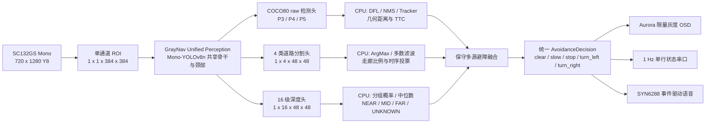

# GrayNav 单目灰度综合避障系统

GrayNav 是面向视障辅助导航场景的边缘端感知原型，运行平台为 Flyingchip A1 Vision Pi，输入来自 SC132GS 单通道灰度相机。本仓库管理板端应用、模型训练与转换脚本、灰度 OSD、串口/语音接口以及可复现的实验记录；完整 A1 SDK、公开数据集、训练输出和 Buildroot 产物不进入 Git。

> 安全边界：GrayNav 当前是研究与演示原型，不应作为无人陪同出行的唯一安全依据。学习深度只提供 `NEAR / MID / FAR / UNKNOWN` 相对证据，不对外播报米制距离。

## 当前状态

| 模块 | 状态 | 说明 |
|---|---|---|
| 板上回退版本 | 已部署、受保护 | 真单通道 ROD25 YOLOv8n 检测、跟踪、几何测距、避障决策、Aurora OSD 和 SYN6288 语音 |
| COCO80 + SurfaceDepth 双模型候选 | 已烧录、板测失败 | 人体检测可运行，但 SurfaceDepth 进入降级状态；道路/墙面/台阶没有有效结果，分时调度与现有 OSD 不再作为目标架构 |
| SurfaceDepth E3 | 已训练并完成 A1 INT8 转换 | 训练与转换证据保留，作为统一模型道路/深度分支的设计基线；独立双模型部署停止推进 |
| 统一感知模型 | 随机图 A1 静态预审通过 | 单个真单通道共享骨干同时输出 COCO80 raw 检测头、4 类道路分割头和 16 级相对深度头；尚未联合训练或正式转换 |
| 板端后处理 | 待重构 | 统一单模型输出绑定、目标/道路时序、保守决策、限量灰度 OSD、单行串口与事件驱动语音 |
| Aurora | 不修改客户端 | 取消密集动态点阵文字和风险条；板端只输出少量检测框、静态状态贴图和必要道路形状 |

2026-08-11 双模型候选已经烧录并实测。串口持续报告 `perception=DETECTION_DEGRADED_SURFACE_DEPTH`、`degraded=1` 和 `hazard=UNKNOWN`，说明板端实际运行的是 detector-only 降级链路，而不是完整道路感知。Aurora 同时出现密集黑点、文字重叠和难以理解的高频串口输出。该镜像被判定为失败实验，不得标记为可用候选。

下一阶段改为单一共享骨干模型。相机输入、训练、ONNX、量化校准和板端张量必须全部保持真单通道；不再通过 `[G,G,G]` 灰度复制运行检测器，也不再常驻两个 `model_id` 或采用 `D/D/D/SD` 双模型分时调度。

## 目标系统架构



统一模型详细契约、训练门控和板端重构边界见 [单模型重构设计](docs/GRAYNAV_UNIFIED_PERCEPTION_REDESIGN_2026-08-11.md)。

### SurfaceDepth E3 契约

```text
input
  images        float32  1 x 1 x 256 x 256  range [0, 1]

outputs
  seg_logits    INT8     1 x 4 x 64 x 64
  depth_logits  INT8     1 x 16 x 64 x 64

surface classes
  0 ground_candidate
  1 blocked_surface
  2 step_or_drop
  3 unknown_other
```

模型始终使用真单通道输入，训练数据在加载阶段转换为灰度，板端不执行 Y8 到 BGR 的复制。E3 使用真实 `64 x 64` 细节融合分支；部署图只保留静态 Conv、ReLU、Add、Concat、Pool 和 Resize 等 A1 安全算子，Softmax、ArgMax、时序过滤和决策全部放在 CPU。

## 模型证据摘要

SurfaceDepth E3 选择 epoch 49 的 `best_seg.pt`。公开验证集上的主要结果如下：

| 指标 | 结果 |
|---|---:|
| ground IoU | 0.6209 |
| blocked IoU | 0.6441 |
| step precision / recall / F1 | 0.7777 / 0.9318 / 0.8478 |
| 危险真值误判为 ground | 3.37% |
| NYUv2 AbsRel / delta1 | 0.2416 / 0.6480 |
| 近远排序准确率 | 0.8778 |

这些指标说明模型具备可用于板端实验的分割和相对深度能力，但 ADE20K 小台阶召回、楼梯外部误报和跨相机域泛化仍有限，因此板端必须保留 `UNKNOWN_OTHER`、时序投票、走廊约束以及检测/几何信息融合。

正式 ONNX 与官方 A1 INT8 转换均已完成：

| 产物/检查 | 结果 |
|---|---|
| ONNX | 4,593,443 bytes，静态 opset 12，A1 本地算子预审通过 |
| PyTorch / ONNX | 分割网格一致率 1.0000；深度等级一致率 0.9999976 |
| INT8 `.m1model` | 1,459,634 bytes |
| 官方余弦相似度 | `seg_logits=0.98599`，`depth_logits=0.99582` |
| FP32 / INT8 远近等级 | 单元格一致率 95.61%（离线补充分析） |

完整哈希、转换契约与部署限制见 [SurfaceDepth E3 部署证据](docs/GRAYNAV_SURFACE_DEPTH_E3_DEPLOYMENT_EVIDENCE.md)。训练和门控实验见 [E0-E3 实验说明](docs/GRAYNAV_SURFACE_DEPTH_OPTIMIZATION_EXPERIMENTS.md)，本地集成与上板顺序见 [后处理、构建和板测计划](docs/GRAYNAV_LOCAL_INTEGRATION_AND_BOARD_TEST_PLAN_2026-08-11.md)。

## 仓库结构

```text
board/
  obstacle_detect/
    demo_obstacle.cpp       A1 相机、NPU、调度与系统入口
    include/                公共数据结构和模块接口
    src/                    检测、分割/深度后处理、融合、OSD、语音
    tests/                  可在主机运行的后处理与决策测试
    app_assets/             受控模型与 OSD 资源
    scripts/                镜像候选归档等辅助脚本
  buildroot/                SDK Buildroot 集成文件

model_optimization/
  segmentation/             单通道 Fast-SCNN / SurfaceDepth 模型
  scripts/                  数据准备、训练、评估、导出和审计
  configs/                  A1 转换预处理配置
  tests/                    数据映射、模型和实验门控测试

docs/                       设计、实验、部署证据和交接文档
```

## 本地开发与构建

Git 仓库是代码管理副本；实际 A1 SDK 编译源位于：

```text
E:\jichuang\docker\docker_test\data\A1_SDK_SC132GS\smartsens_sdk
```

板端代码每次完成一个可测试目标后，必须把 `board/obstacle_detect` 的对应改动同步到 SDK：

```text
smart_software/src/app_demo/obstacle_detect/ssne_ai_demo
```

随后在 `A1_Builder` 中执行完整构建：

```powershell
docker exec A1_Builder sh -lc `
  'cd /home/smartsens_flying_chip_a1_sdk/A1_SDK_SC132GS/smartsens_sdk && ./scripts/a1_sc132gs_build.sh'
```

候选镜像输出：

```text
E:\jichuang\docker\docker_test\data\A1_SDK_SC132GS\smartsens_sdk\output\images\zImage.smartsens-m1-evb
```

构建成功不代表板测通过。烧录前还要核对 CMakeCache、统一模型的名称/哈希、`zImage < 15 MiB`，并为新候选单独建立归档。

## 运行与演示原则

- NPU 每个调度帧只运行一个统一模型，不进行模型切换；上方 ROI 使用检测输出，下方 ROI 同时使用检测、道路与深度输出。
- `step_or_drop` 持续成立时优先于深度头给出的 `FAR`。
- 深度 NEAR/MID/FAR 分组最高与次高概率差小于 `0.20` 时输出 `UNKNOWN`，决策至少为 `slow`。
- `unknown_other` 不能作为可通行地面；检测与道路理解均稳定无风险时才允许 `clear`。
- 任一输出契约或推理失败时进入统一感知降级，显示一个静态 `AI_FAIL` 状态，不得用失效深度驱动 `NEAR` 或反复刷屏。
- Aurora 每帧最多显示三个稳定目标框、一个动作贴图和一个道路符号；禁止动态绘制物体单词、风险点阵条或大面积掩膜。
- 正常串口默认每秒一行面向演示的状态；张量、比例和时序细节只在显式诊断模式输出。

## 回退保护

当前板上可靠回退镜像必须保持只读：

```text
bytes  = 8,214,488
SHA256 = A7976710ECB456CB312D18F0195DCAE496ED652EFC582AB698EBC3EB7B055530
```

至少保存在：

```text
E:\jichuang\files\zImage.smartsens-m1-evb
E:\jichuang\firmware_archive\GrayNav_B3_1ch_DCE_25class_A7976710\zImage.smartsens-m1-evb
```

新构建禁止覆盖以上文件。只有完成统一模型加载、30 分钟稳定性、降级回退和功能场景测试后，才可通过 `board/obstacle_detect/scripts/archive_candidate.ps1` 归档为新候选。

## 提交规则

- 一个 commit 只解决一个主要目标，显式暂存文件，禁止在混合工作区使用无范围的 `git add -A`。
- 不提交 SDK 全树、公开数据集、云端训练目录、临时压缩包或 Buildroot 输出。
- 模型二进制只有在契约、来源、大小和 SHA256 完整记录后才允许作为受控板端资产提交。
- C++ 改动先运行主机单元测试，再同步 SDK；完成一个实质性板端阶段后才执行完整 Docker 构建。
- README 和状态文档必须明确区分：`已训练`、`已转换`、`已构建`、`已烧录`、`已验收`。
