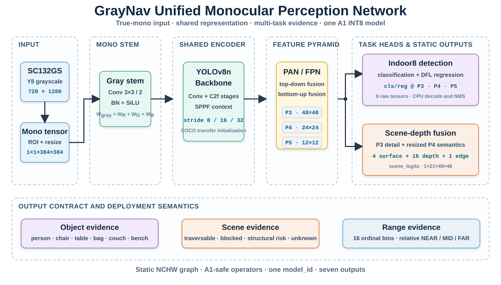
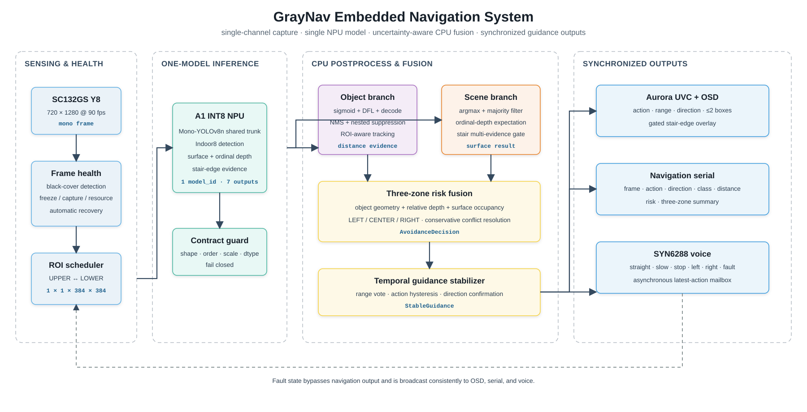

# GrayNav: True-Monocular Unified Perception for Indoor Assistive Navigation

<p align="center">
  <b>单通道目标检测 · 路面理解 · 台阶感知 · 相对深度 · A1 边缘部署</b>
</p>

GrayNav 是面向视障辅助导航的单目灰度综合感知系统。系统以 SC132GS Y8 图像为唯一视觉输入，在一个共享骨干网络中联合完成室内障碍物检测、地面/阻挡面/台阶语义分割、16 级相对深度估计与台阶边缘响应，并在 Flyingchip A1 上通过单个 INT8 模型实时运行。板端 CPU 将模型输出与几何测距、时序跟踪、三区通行性和故障保护融合，统一生成 `CLEAR / SLOW / STOP / LEFT / RIGHT / SYSTEM_FAULT` 指令，并同步驱动 Aurora 灰度 OSD、串口和 SYN6288 语音链路。

## Highlights

- **True-mono end-to-end contract.** 训练、ONNX、量化校准和板端输入始终保持 `1×1×384×384`；RGB 预训练检测器通过 `W_gray = W_R + W_G + W_B` 等价折叠为单通道首层。
- **One model, multiple safety cues.** 一个 YOLOv8n 共享骨干同时输出 8 类室内目标、4 类场景语义、16 级相对深度和台阶边缘，板端仅加载一个 `.m1model`、分配一个 `model_id`。
- **Non-random transfer initialization.** 检测分支继承官方 COCO YOLOv8n 权重，场景与深度分支继承 GrayNav SurfaceDepth E3 权重；新增兼容层采用近似恒等初始化。
- **A1-safe deployment graph.** NPU 图只保留静态 Conv/BN/ReLU/Add/Concat/Pool/Resize 等安全算子；DFL、NMS、ArgMax、深度期望、跟踪和决策在 CPU 执行。
- **Uncertainty-aware navigation.** 几何距离、场景相对深度、目标轨迹和三区通行性采用保守融合，避免把未经物理标定的单目结果宣称为精密米制测量。
- **Bounded presentation path.** 灰度 OSD 采用固定资源和图元预算；串口、OSD 与语音消费同一稳定决策，且推理、UART 或相机异常均有降级保护。

## Architecture

### Unified perception network

<p align="center">
  
</p>

输入为 `images: 1×1×384×384`。共享 Mono-YOLOv8n Backbone 与 PAN/FPN 产生 P3/P4/P5 特征；检测头保留三个尺度的原始分类和 DFL 回归输出。P3 细节与 P4 语义通过轻量融合分支生成 `scene_logits: 1×21×48×48`：

| 通道 | 语义 |
|---|---|
| `0..3` | `ground_candidate / blocked_surface / step_or_drop / unknown_other` |
| `4..19` | 0.3–8.0 m 对数间隔的 16 级相对深度 logits |
| `20` | stair-edge response |

检测类别为 `person / chair / dining_table / backpack / handbag / suitcase / couch / bench`。普通未命名障碍仍可由 `blocked_surface + relative depth` 进入通用避障逻辑。

完整输出契约：

| Tensor | Shape |
|---|---:|
| `cls_p3 / reg_p3` | `1×8×48×48 / 1×64×48×48` |
| `cls_p4 / reg_p4` | `1×8×24×24 / 1×64×24×24` |
| `cls_p5 / reg_p5` | `1×8×12×12 / 1×64×12×12` |
| `scene_logits` | `1×21×48×48` |

### Embedded navigation system

<p align="center">
  
</p>

720×1280 Y8 视频以 `LOWER → LOWER → UPPER` 的 ROI 周期送入同一网络：下方视野强化地面、台阶与近场障碍，上方视野补充人体和家具检测。CPU 依次完成 raw-head 解码、DFL、NMS、目标跟踪、场景多数滤波、台阶多证据确认、距离融合、三区规划和非对称时序稳定。详见 [系统与算法](docs/SYSTEM.md) 和 [模型方法](docs/METHOD.md)。

## Quantitative Results

统一模型的离线验证结果如下。检测数据由 VOC2007 Indoor8 子集与 COCO128 稀有类别重放组成；场景与深度使用 ADE20K、StairNetV3 和 NYU Depth V2 官方划分。

### Detection and partial-person robustness

| Metric | Result |
|---|---:|
| Person AP50 | **0.7712** |
| Person recall | **0.9199** |
| Partial-person recall | **0.9598** |
| Chair AP50 | 0.5831 |
| Dining-table AP50 | 0.6112 |
| Couch AP50 | 0.6701 |

### Scene, stair and relative depth

| Metric | Result |
|---|---:|
| Ground IoU | 0.5731 |
| Blocked-surface IoU | 0.5735 |
| Step F1 | **0.7055** |
| Stair-edge F1 | 0.0805 |
| No-stair step false-positive rate | 0.1244 |
| Depth AbsRel | 0.3668 |
| Depth δ1 | 0.4835 |
| Near/far ordering accuracy | **0.8348** |

独立 stair-edge 指标表明单边缘输出不适合单独触发停车，因此板端要求语义区域、水平边缘、深度跳变与时序一致性共同确认。量化转换的 7 个输出平均余弦相似度为 `0.9413–0.9946`，所有逐样本输出均不低于 `0.9160`。完整记录见 [结果与证据](docs/RESULTS.md) 和 [`results/a1_conversion.json`](results/a1_conversion.json)。

## Repository Layout

```text
graynav-obstacle-detect/
├── training/                  # 数据准备、训练、评估、可视化、ONNX 与量化数据构建
│   ├── models/                # SurfaceDepth 与统一感知网络核心实现
│   ├── scripts/               # 可复现命令行工具
│   └── tests/                 # 模型、数据映射、损失和导出契约测试
├── board/                     # A1 C++ 推理、测距、跟踪、规划、OSD、串口和语音
│   ├── obstacle_detect/       # 可直接同步到官方 SDK 的应用
│   ├── rootfs_overlay/        # 启动脚本
│   └── sdk_overlay/           # Buildroot package 配置
├── weights/                   # 预训练初始化、最终 checkpoint 与 ONNX
├── results/                   # 转换审计和发布证据
└── docs/                      # 方法、系统、复现和结果说明
```

## Reproduction

### 1. Local environment

推荐 Windows 11、Python 3.10、CUDA GPU。默认工作区位于 E 盘，数据、环境、缓存和运行输出不会写入仓库：

```powershell
powershell -ExecutionPolicy Bypass -File training/setup_windows.ps1 `
  -WorkRoot E:\GrayNavWorkspace `
  -BasePython E:\Anaconda3\python.exe
```

### 2. Prepare public data

检测分支使用体积较小的 VOC2007 trainval，并可加入 COCO128 稀有类重放；无需下载完整 COCO：

```powershell
powershell -ExecutionPolicy Bypass -File training/prepare_detection_data.ps1 `
  -WorkRoot E:\GrayNavWorkspace
```

将 `ADEChallengeData2016.zip`、`RGB-D stair dataset.zip`、`nyu_depth_v2_labeled.mat` 和 `splits.mat` 放入 `E:\GrayNavWorkspace\data\raw`，然后执行：

```powershell
powershell -ExecutionPolicy Bypass -File training/prepare_scene_data.ps1 `
  -WorkRoot E:\GrayNavWorkspace
```

### 3. Train

RTX 4060 8 GB 可使用 `batch=16`、梯度累积 2 步得到有效 batch 32：

```powershell
powershell -ExecutionPolicy Bypass -File training/train_local.ps1 `
  -WorkRoot E:\GrayNavWorkspace `
  -BatchSize 16 `
  -AccumulationSteps 2
```

训练固定 `seed=42`、AdamW、初始学习率 `3e-4`、weight decay `0.01`、AMP、5 epoch 场景分支预热和 35 epoch 联合优化。命令行显示 tqdm，TensorBoard 日志写入 `E:\GrayNavWorkspace\runs\unified_indoor8_v1\tensorboard`。

### 4. Evaluate and export

```powershell
E:\GrayNavWorkspace\env\Scripts\python.exe training/scripts/evaluate_unified.py --help
E:\GrayNavWorkspace\env\Scripts\python.exe training/scripts/visualize_unified.py --help
E:\GrayNavWorkspace\env\Scripts\python.exe training/scripts/export_unified.py --help
E:\GrayNavWorkspace\env\Scripts\python.exe training/scripts/audit_unified_onnx.py --help
E:\GrayNavWorkspace\env\Scripts\python.exe training/scripts/build_a1_calibration.py --help
```

详细数据契约、命令参数和转换边界见 [复现指南](docs/REPRODUCIBILITY.md)。

## A1 Deployment

将板端源码同步到官方 SC132GS SDK：

```powershell
powershell -ExecutionPolicy Bypass -File board/sync_to_sdk.ps1 `
  -SdkRoot E:\jichuang\docker\docker_test\data\A1_SDK_SC132GS\smartsens_sdk
```

在 `A1_Builder` 容器中执行 SDK 的完整 Buildroot 构建。CMake 安装白名单只允许统一模型和固定 OSD 资源进入 rootfs；发布门控要求最终 `zImage < 15 MiB`，模型 SHA256 必须为：

```text
33eec832710706b1153f468f219c08389a52ba3d21cbdffcde32ca5e25d66da8
```

板端模块说明、环境变量与构建验证见 [`board/README.md`](board/README.md)。

## Model Zoo

| Artifact | Purpose | SHA256 |
|---|---|---|
| `weights/yolov8n.pt` | official COCO detector initialization | `f59b3d83...fc83b36` |
| `weights/graynav_surface_depth_e3_epoch49.pt` | scene/depth transfer initialization | `31a305b4...5cdc2a` |
| `weights/graynav_unified_best_safety_epoch29.pt` | selected FP32 checkpoint | `f28e5732...2645f23` |
| `weights/graynav_unified_indoor8_scene21.onnx` | static deployment graph | `2902d0ae...37ae54` |
| `board/.../graynav_unified_indoor8_scene21.m1model` | A1 INT8 runtime model | `33eec832...d66da8` |

完整字节数和哈希见 [`weights/README.md`](weights/README.md) 与 [`results/release_manifest.json`](results/release_manifest.json)。

## Navigation and Safety Boundary

板端公开米制距离是融合估计值，用于阈值决策和调试，不是经标定测量仪器输出。最终策略采用 `<0.80 m → STOP`、`0.80–1.50 m → SLOW`、`≥1.50 m → CLEAR`；侧方障碍在 1.50 m 内优先给出反向绕行建议。台阶、异常和系统故障具有更高优先级。

GrayNav 是研究与工程验证系统，不构成医疗器械或独立出行安全保证。测试人员不应闭眼或在无人保护条件下依赖系统行走。

## Documentation

- [模型方法](docs/METHOD.md)
- [系统与后处理](docs/SYSTEM.md)
- [复现指南](docs/REPRODUCIBILITY.md)
- [结果与可靠性证据](docs/RESULTS.md)
- [训练代码说明](training/README.md)
- [A1 板端说明](board/README.md)
