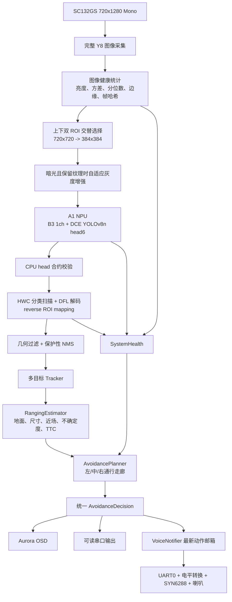

# GrayNav 项目开发交接文档

> 状态日期：2026-07-27  
> 用途：供新的 Codex 会话或新开发成员直接接手当前项目。  
> 原则：本文以本地实际 SDK、当前 Git 代码、模型产物和已完成实验为准。历史方案中未落地的功能不视为当前实现。

## 1. 项目概况

### 1.1 比赛与作品

- 比赛：第十届全国大学生集成电路创新创业大赛。
- 企业赛题：思特威赛题二，高帧率机器视觉应用。
- 当前作品方向：面向盲人通行的边缘端单目视觉避障系统。
- 技术报告中使用的作品名称：**基于边缘端单目深度解算的高动态导盲与空间感知系统**。
- 队伍编号：`CICC1004527`。
- 队伍名称：`全捕逗队`。

系统以 SC132GS 单色图像传感器和飞凌微 A1 Vision Pi 为核心，在板端完成目标检测、目标跟踪、单目测距、风险评估、避障决策、Aurora OSD 显示、串口信息输出、SYN6288 语音播报和异常保护。

### 1.2 当前产品目标

系统面向真实盲人行走场景，不只要求“识别出物体”，而是要连续回答：

1. 当前画面是否可靠。
2. 哪些目标会影响通行。
3. 目标位于左、中央还是右侧。
4. 目标是近距离、警告距离还是远距离。
5. 当前应直行、减速、停下、左转还是右转。
6. 设备异常时是否能进入保护状态并提示用户。

当前动作集合固定为：

| 内部动作 | OSD/串口 | 中文语音 |
|---|---|---|
| `clear` | `CLEAR` | 直行 |
| `slow` | `SLOW` | 减速 |
| `stop` | `STOP` | 停下 |
| `turn_left` | `LEFT` | 左转 |
| `turn_right` | `RIGHT` | 右转 |
| `system_fault` | `FAULT` | 异常 |

## 2. 赛题要求与验收重点

### 2.1 功能完成度

根据本地赛题资料和评分截图，功能目标部分强调：

- 至少覆盖 5 项可展示功能。
- 稳定运行不少于 60 秒。
- 环境、版本、命令和参数齐全，能够一键运行并复现场景。
- 在正常光照和暗光场景下保持稳定。
- 异常处理必须覆盖摄像头/数据、模型推理、系统资源三类异常，并具备检测、告警、保护和恢复策略。

当前系统已经形成以下可展示功能：

1. 单通道灰度目标检测。
2. 多目标跟踪与检测框稳定。
3. 单目距离与 TTC 估计。
4. 左/中/右通行风险评估。
5. Aurora OSD 检测框和动作叠加。
6. 可读串口避障信息。
7. UART 语音导航。
8. 三类异常检测和安全保护。

### 2.2 应用性能

评分截图给出的核心量化方式包括：

\[
R=\frac{FPS_{app}}{FPS_{sensor}}
\]

- 实时性基础分为 `floor(10 * min(R, 1.0))`。
- 丢帧率超过 5%会扣分。
- FPS 波动大，即 P95 与均值差异超过 20%，会扣分。
- 端到端延迟按传感器帧周期 `T` 计分：不超过 `1T` 得分最高，约 `5T` 得 6 分，超过 `11T` 得 0 分。

因此现场展示不能只看平均 FPS，还要保留：

- 平均 FPS、P50、P95。
- 每阶段耗时。
- 丢帧率。
- 60 秒稳定性。
- 故障检测和恢复次数。

### 2.3 创新性

评分强调技术创新、工程深度和场景价值。本项目当前可成立的模型创新点是：

1. **YOLOv8n 真正单通道输入改造**。
2. **DCE 灰度方向上下文增强模块**。
3. **面向 ROD25 避障场景的灰度域微调训练**。

系统创新点包括：

- 双 ROI 全视野交替推理。
- A1 head6 原始张量与 CPU 后处理分工。
- 多源不确定度单目测距。
- 基于三通行走廊的避障规划。
- 最新动作邮箱式非阻塞语音输出。
- 摄像头、推理、资源异常闭环。

> 评分截图只显示了功能完成度 40 分、应用性能 20 分、应用创新性 20 分，共 80 分。本文不推测截图未显示的剩余 20 分细则。

## 3. 硬件与工具链约束

### 3.1 SC132GS 图像传感器

| 项目 | 当前值 |
|---|---|
| 类型 | Mono 单色灰度传感器 |
| 输出 | `720 x 1280 @ 90 fps` |
| 传感器尺寸 | 1/4 英寸 |
| 镜头 | 2.1 mm |
| 对角/水平/垂直 FOV | 86.7° / 49.7° / 78.9° |
| 当前相机高度 | 0.71 m |
| 当前向下俯仰角 | 15° |

代码中的完整图像坐标是宽 `720`、高 `1280` 的竖幅坐标。

### 3.2 A1 Vision Pi

| 资源 | 规格 |
|---|---|
| CPU | 单核 Arm Cortex-A7，最高 1.2 GHz |
| NPU | 0.8 TOPS @ INT8 |
| 内存 | DDR3L 16 bit 1 Gb stacked |
| 存储 | 256 Mb NOR Flash |
| 外设 | MIPI、SPI、I2C、UART、GPIO |

这些约束决定：

- NPU 负责卷积网络主干和 raw head。
- DFL Softmax、box decode、NMS、tracker、测距和规划保留在 CPU。
- 必须限制候选数量、动态分配、OSD 更新率和日志频率。
- 烧录镜像必须控制体积，历史模型不能全部安装进最终镜像。

### 3.3 A1 ONNX/模型转换约束

本地官方资料给出的重要约束应按更严格口径执行：

- 输入使用 ONNX，历史流程建议 opset 12。
- Conv 的 kernel、stride、padding 不超过 16。
- `Kw * Kh * Cin <= 2048`。
- group convolution 仅使用 `group=1` 或 `group=Cin`。
- Pooling kernel 按不超过 `8 x 8` 处理。
- BatchNorm、Add、Concat、Mul、ReLU、Sigmoid 等较适合。
- Sub、Div、Softmax、Transpose、动态 reshape 等可能不支持、转换不稳定或 NPU 利用率低。
- YOLO 不应把 DFL、Softmax、NMS、复杂 transpose/concat 放进部署 ONNX。

当前采用官方推荐的 head6 分割方式：

```text
3 个分类 raw head + 3 个 DFL 回归 raw head
                     |
                     v
       A1 CPU 完成 sigmoid / DFL / box / NMS
```

模型转换请求需要：

- head6 ONNX。
- `config.toml`。
- 与输入 dtype、shape、NCHW 顺序一致的 `.npy` 校准数据。
- `datasets.zip`，量化校准建议不少于 20 个样本，评估样本不少于 10 个。

模型必须随 SDK 编译进 `zImage`，不能按普通 Linux 应用用 `scp` 临时替换。

## 4. 当前端到端系统架构



主线程每帧只运行一次 NPU 推理。上下 ROI 交替覆盖完整竖幅画面，以扩大视野，同时避免每帧双推理导致吞吐量减半。

## 5. 当前模型状态

### 5.1 当前部署模型

| 项目 | 值 |
|---|---|
| 文件名 | `graynav_rod25_gray1_dce_b3_head6.m1model` |
| 输入 | `1 x 384 x 384` 单通道灰度 |
| 类别数 | 25 |
| `REG_MAX` | 16 |
| 输出 | 6 个 raw head |
| 量化部署 | A1 `.m1model`，INT8 工具链 |

输入 384 时的 head 合约：

| 类型 | stride | 形状 |
|---|---:|---|
| 分类 | 8 | `25 x 48 x 48` |
| 分类 | 16 | `25 x 24 x 24` |
| 分类 | 32 | `25 x 12 x 12` |
| DFL | 8 | `64 x 48 x 48` |
| DFL | 16 | `64 x 24 x 24` |
| DFL | 32 | `64 x 12 x 12` |

板端运行时按 HWC layout 读取。首帧必须校验 head 数、宽高、通道、stride、dtype 和 layout，校验失败不得进入后处理。

### 5.2 三个模型创新点

#### 真正单通道输入

原始 YOLOv8n 首层卷积权重：

\[
W_{rgb}=[W_R,W_G,W_B]
\]

灰度复制三通道时，首层响应为：

\[
W_RY+W_GY+W_BY=(W_R+W_G+W_B)Y
\]

因此 B3 将三通道权重折叠为：

\[
W_{gray}=W_R+W_G+W_B
\]

首层从 `(16,3,3,3)` 改为 `(16,1,3,3)`。训练证据确认：

```text
first_conv_shape_before_fold=(16, 3, 3, 3)
first_conv_shape_after_fold=(16, 1, 3, 3)
one_channel_first_conv_initialized=True
```

这既继承 RGB 预训练首层对亮度组合的响应，又避免板端复制三通道。

#### DCE 灰度方向上下文增强

DCE 放在 YOLOv8n 特征网络中，使用轻量水平和垂直非对称卷积分支增强灰度图像的边缘、轮廓和方向结构。核心思想是：

- 水平分支关注横向轮廓、台阶边沿、座椅边缘。
- 垂直分支关注人体、立柱、椅腿等竖向结构。
- 分支特征经融合和残差连接回到主特征。
- 使用 A1 友好的卷积、逐元素加法和激活，不把复杂动态算子放进模型。

DCE 的目标不是恢复真实颜色，而是在失去颜色后强化单色图像仍然可靠的形状和方向信息。

#### ROD25 灰度域微调

训练和评估输入均转换为单通道灰度，目标头统一为 ROD25 25 类。这样可以让网络的浅层和检测头适应：

- 单色传感器的亮度统计。
- 室外/通行障碍目标。
- 低对比、噪声、运动模糊和曝光变化。

该训练不是从零开始，仍以 YOLOv8n 预训练权重为起点，并使用首层折叠初始化。

### 5.3 B1/B2/B3 公平实验

| 实验 | 输入 | DCE | 任务头 |
|---|---|---|---|
| B1 | 灰度复制三通道 | 无 | ROD25 25 类 |
| B2 | 灰度复制三通道 | 有 | ROD25 25 类 |
| B3 | 真正单通道 | 有 | ROD25 25 类 |

三组使用同一任务类别，避免用 COCO 80 类原始模型直接评估 ROD25 而造成人为低基线。

B3 训练 100 epoch，约 1.137 小时：

| Split | Precision | Recall | mAP50 | mAP50-95 |
|---|---:|---:|---:|---:|
| val | 0.882 | 0.810 | 0.870 | 0.665 |
| test | 0.886 | 0.818 | 0.877 | 0.681 |

clean test 对比：

| 模型 | AP50/mAP50 | AP/mAP50-95 |
|---|---:|---:|
| B1 | 0.8606 | 0.6791 |
| B2 | 0.8598 | 0.6765 |
| B3 | 0.8772 | 0.6812 |

B3 相对 B1：AP50 `+0.0166`，综合 AP 约 `+0.0020`。  
B3 相对 B2：AP50 `+0.0175`，综合 AP 约 `+0.0046`。

注意：B1/B2 的 fair eval 使用 COCO API 字段，B3 使用 Ultralytics 字段。任务数据和类别一致，但字段来源不同，严谨展示时应说明这一点。

### 5.4 六类扰动鲁棒性

测试场景：

- `normal`
- `low_light`
- `high_exposure`
- `low_contrast`
- `motion_blur`
- `noise`

六场景平均：

| 模型 | Precision | Recall | mAP50 | mAP50-95 |
|---|---:|---:|---:|---:|
| B1 | 0.8693 | 0.7774 | 0.8427 | 0.6362 |
| B2 | 0.8805 | 0.7799 | 0.8440 | 0.6431 |
| B3 | 0.8522 | 0.7571 | 0.8215 | 0.6189 |

关键结论：

- B3 在 normal 下 mAP50=`0.8772`、mAP50-95=`0.6809`，三组最佳。
- B2 的六场景平均鲁棒性最好。
- B3 在低光和高曝光下降明显，不能宣称所有扰动下全面优于 B1/B2。
- 板端已加入“暗光且仍有纹理时”的自适应灰度增强，但这属于运行时补偿，不能替代模型侧鲁棒训练。

### 5.5 类别与当前能力边界

ROD25 原始类别顺序：

```text
bike, building, car, person, stairs, traffic_sign, electrical_pole,
road, motorcycle, dustbin, dog, manhole, tree, guard_rail,
pedestrian_crosswalk, truck, bus, bench, traffic_cone, fire_hydrant,
traffic_barrel, plant_pot, electrical_box, chair, bicycle_rack
```

- `road` 在板端过滤，不作为障碍框。
- 原始类别保留用于串口和调试。
- 避障决策映射到 8 个稳定语义：`person`、`chair/seat`、`table/desk`、`sofa/bed`、`bag/suitcase`、`small_object`、`vehicle/bicycle`、`generic_obstacle`。
- ROD25 没有 cup、screen、monitor、通用 cardboard box、table 等细粒度标签。不能把这些类别描述为模型的直接识别能力。
- 箱体当前主要依赖 `dustbin/electrical_box/traffic_barrel/bicycle_rack` 等近似外观证据映射为通用障碍。
- 人体局部识别仍受模型 raw response 限制。板端 person 备选证据、局部人体桥接和 tracker 可以恢复弱响应，但不能在网络完全无 person 证据时凭空生成检测。

## 6. 图像输入与双 ROI

### 6.1 当前策略

在线 pipeline 保留完整 `720 x 1280` 图像，不再使用旧版固定 `y=370` 裁剪。

两个 ROI：

| 视图 | ROI |
|---|---|
| UPPER | `(x=0, y=0, w=720, h=720)` |
| LOWER | `(x=0, y=560, w=720, h=720)` |

重叠区域为 160 像素。奇偶帧交替推理，每个 ROI 缩放到 `384 x 384`。

这样解决了固定裁剪可能完全丢掉画面顶部人脸、人体和边缘障碍的问题。代价是单一区域的实际观测频率约为总推理频率的一半，因此 tracker 必须理解 ROI 可见性，不能把“本帧在另一个 ROI”当成目标丢失。

### 6.2 自适应灰度增强

当前增强只在画面较暗且仍存在纹理时开启，避免对镜头遮挡、全黑或过曝画面做错误增强。

默认参数：

```text
A1_ADAPTIVE_GRAY=1
A1_ADAPTIVE_GRAY_DARK_MEAN=75
A1_ADAPTIVE_GRAY_BLEND=60
A1_ADAPTIVE_GRAY_BRIGHT_MEAN=195
```

增强逻辑不能替代健康检测。镜头遮挡应进入 `system_fault`，不能增强后继续输出 `CLEAR`。

## 7. head6 CPU 后处理

后处理主文件为 `src/yolov8_gray.cpp`。

主要流程：

1. 选择当前 ROI 并生成 384 单通道输入。
2. 执行 NPU inference。
3. 读取并配对 6 个输出 tensor。
4. 校验 25 类分类 head 和 64 通道 DFL head。
5. 按 HWC 直接扫描分类 tensor。
6. 对每个 anchor 保留 top-1 类，并保留必要的 person 备选证据。
7. 只有超过候选阈值的 anchor 执行 DFL softmax。
8. 解出 left/top/right/bottom 距离。
9. 从 feature map 坐标映射到 384，再映射回 ROI 和完整 Aurora 坐标。
10. 过滤极端宽框、极端扁框、低质量边缘框和不可靠 coarse 框。
11. 执行保护性多目标 NMS。

当前候选阈值偏向召回，风险触发另有更严格的几何和时序条件：

- person：约 `0.08`
- chair/seat：约 `0.16`
- dustbin/electrical_box：约 `0.18`
- traffic_barrel/bicycle_rack：约 `0.20`
- vehicle/bicycle：约 `0.28`
- 其他一般类别：约 `0.24`

候选阈值不能直接等同于“安全风险阈值”。

当前性能上限：

```text
A1_NMS_TOP_K=300
A1_NMS_KEEP_TOP_K=40
OSD 最多显示 6 个框
```

保护性 NMS 的重点是防止一个横向 wide/coarse 大框吞掉其中多个更可靠的小框。

## 8. 多目标跟踪

实现位于 `src/tracker.cpp`。

轨迹关联代价综合：

- IoU。
- 中心距离。
- 尺寸变化率。
- 类别兼容性。
- 当前 ROI 可见性。

每条轨迹保存：

- 完整图像坐标框。
- 速度和时间戳。
- 动态 25 类证据。
- 连续命中和丢失次数。
- 当前距离、速度、方差和 TTC。

当前稳定策略：

- 静止目标使用较强平滑。
- 快速移动目标减少旧框权重，降低视觉延迟。
- 高置信度目标可快速显示。
- 低置信目标需要连续命中。
- 类别证据会衰减，切换具有滞回，不使用永久累计投票。
- 当前 ROI 内目标丢失后快速清除；非当前 ROI 的轨迹可短时保留，但不绘制旧框。
- person 使用备选证据和局部人体桥接，提高腿部、躯干等局部目标的连续性。

若出现“目标移出画面后框仍残留”，优先检查 ROI 可见性和 track miss 清除，不应单纯加大 NMS 阈值。

## 9. 单目测距

实现位于 `src/ranging.cpp`，接口位于 `include/ranging.hpp`。

### 9.1 相机模型

\[
f_x=\frac{W}{2\tan(FOV_h/2)},\qquad
f_y=\frac{H}{2\tan(FOV_v/2)}
\]

当前：

```text
W=720
H=1280
FOV_h=49.7 deg
FOV_v=78.9 deg
camera_height=0.71 m
pitch_down=15 deg
```

### 9.2 地面投影

检测框底部中心像素反投影为相机射线，经俯仰旋转后与地平面求交，得到：

- 前向距离 `z_ground`
- 横向位置 `x_ground`
- 根据像素和安装参数不确定度传播得到的 `sigma_ground`

框底部使用小比例偏移：

```text
A1_GROUND_CONTACT_OFFSET_RATIO=0.012
```

如果框底部并非真实脚底或接地点，地面投影可能偏差。因此人体上半身/腿部局部框会先经过 partial-person 判定。

### 9.3 类别尺寸先验

对 person、chair、bench、dustbin、plant pot 等目标，根据框高或框宽估算：

\[
z_{size}=\frac{fH_{real}}{h_{pixel}}
\]

真实尺寸不是固定常数，而是带方差的类别先验。局部人体会根据头部、肩宽、躯干/腿部等候选宽度先验估计，并给出较大不确定度。

### 9.4 近场上界

框接近画面底部且面积很大时，只得到“距离不超过某上界”的保守信息，例如约 `0.45/0.70/1.00 m`，而不是把这些值当精确测量。

wide、coarse、被边界裁切和低置信框不能轻易触发最短的精确距离。

### 9.5 不确定度融合

地面和尺寸估计先做归一化残差：

\[
r=\frac{|z_g-z_s|}{\sqrt{\sigma_g^2+\sigma_s^2}}
\]

- `r <= 2.5` 时使用逆方差加权融合。
- 冲突时根据类别和几何可靠性选择来源，并增大方差。
- 避障使用保守距离：

\[
z_{safe}=\hat z-k\sigma_z
\]

### 9.6 时序与 TTC

tracker 对距离执行 alpha-beta/Kalman 风格滤波，并在远距离引入逆深度中值以抑制跳变。

- 突然变近立即接受，保证安全。
- 突然变远需要确认，避免障碍瞬间“消失”。
- 至少三次可靠观测后计算 TTC：

\[
TTC=\frac{z}{-\dot z},\quad \dot z<0
\]

当前距离等级：

```text
URGENT < 0.85 m
NEAR   < 1.25 m
WARN   < 2.20 m
TTC stop < 1.40 s
```

未进行完整实体标定前，验收重点应是 `NEAR/WARN/FAR` 和动作正确率，而不是厘米级误差。

## 10. 避障规划

实现位于 `src/avoidance_planner.cpp`。

系统使用左、中央、右三条通行走廊。默认参数：

```text
image sector left/right = 0.42 / 0.58
center half width = 0.22 m
side clear distance = 1.45 m
turn margin = 0.25 m
wide box ratio = 0.88
```

主要规则：

- 中央紧急障碍、全宽近障或 TTC 极短：`STOP`。
- 中央 warning、测距不确定或多目标状态不稳：`SLOW`。
- 障碍明显位于右侧：优先 `LEFT`。
- 障碍明显位于左侧：优先 `RIGHT`。
- 中央阻塞时，只有候选侧有足够安全余量才转向；侧方未知则 `STOP/SLOW`。
- 连续确认中央安全且无近场风险：`CLEAR`。
- 楼梯和井盖属于地面风险，不能只按普通实体绕行。
- building、traffic sign、electrical box 等背景类必须有近场接地证据才触发高风险。

动作滞回：

- `STOP` 和系统故障立即生效。
- 普通方向/速度动作通常需要连续确认。
- 方向翻转约 300 ms。
- `STOP -> 非 STOP` 需稳定约 500 ms。
- `CLEAR` 需稳定约 700 ms。

语音层还额外保留操作时间：

- 播报“停下”后约 2.5 秒再允许后续普通动作。
- 播报左转/右转后约 1.5 秒再允许后续普通动作。

## 11. OSD、串口与语音

### 11.1 Aurora OSD

实现位于 `src/osd-device.cpp`。

- action 和方向/风险文字使用 `.ssbmp` 资源。
- 检测框最多显示 6 个。
- 框按风险、距离、质量和置信度排序。
- coarse 大框不得覆盖内部更可靠的小框。
- OSD 默认每 2 帧更新一次，减少绘制开销。

### 11.2 串口输出

正常导航输出以一行可读字段为主：

```text
[NAV] frame=... speed=SLOW direction=LEFT obstacle=chair distance=1.20m risk=WARNING
```

五个核心信息分别对应：

1. 速度建议。
2. 方向建议。
3. 障碍物类别。
4. 单目测距结果。
5. 风险等级。

故障输出示例：

```text
[FAULT] frame=1495 status=ACTIVE type=CAMERA_DATA
reason=LENS_BLOCKED_OR_INVALID_IMAGE protection=STOP
voice=ABNORMAL recovery=AUTO_MONITORING
```

字段含义：

- `status=ACTIVE`：故障仍然有效。
- `type`：摄像头/数据、推理或资源异常。
- `reason`：具体触发证据。
- `protection=STOP`：动作被安全状态覆盖。
- `voice=ABNORMAL`：语音播报“异常”。
- `recovery=AUTO_MONITORING`：系统持续观察恢复条件。

### 11.3 SYN6288 语音

实现位于 `src/voice_notifier.cpp`。

接线：

```text
A1 P4 pin 15, D0 UART0TX -> 1.8/3.3V 电平转换 -> SYN6288 RX
A1 P4 pin 16, D2 UART0RX <- 1.8/3.3V 电平转换 <- SYN6288 TX
A1 GND 与语音模块 GND 共地
```

- A1 UART 信号为 1.8 V，SYN6288 侧为 3.3 V，必须经过电平转换。
- 当前不使用 BUSY GPIO。
- UART0 使用 9600 8N1。
- 当前采用已经板端验证可连续播报的固定 GBK 帧。
- ACK 和主动 busy 查询默认关闭，因为该硬件回传链路实测不稳定；被动 RX 只做统计，不作为持续播报前提。

语音线程采用“最新动作邮箱”：

1. 推理主线程只更新最新动作，不直接阻塞发送。
2. 语音线程按最小 TX 间隔发送。
3. 未发送的旧动作被新动作覆盖，不排队播过期指令。
4. `STOP` 和 `system_fault` 优先级最高。
5. 同一动作按周期重复，使导盲提示持续存在。

当前默认节奏：

```text
CLEAR repeat = 1200 ms
STOP repeat = 1600 ms
FAULT repeat = 1800 ms
minimum TX gap = 800 ms
byte gap = 2000 us
post TX delay = 30 ms
```

`system_fault` 期间必须持续播报“异常”，不能穿插“直行”。恢复后需满足健康恢复帧数，再恢复普通导航动作。

## 12. 异常检测与保护

主实现位于 `demo_obstacle.cpp` 的 `SystemHealth`。

### 12.1 摄像头/数据异常

检测证据包括：

- 连续取帧失败。
- 全局和中心区域过暗/过亮。
- 灰度方差、P5-P95 动态范围和边缘比例过低。
- 多帧采样哈希完全相同，判定画面冻结。
- 多证据累计的镜头遮挡 score。

当前遮挡参数：

```text
cover score threshold = 5
trigger frames = 3
recovery frames = 18
```

保护：

- 清除检测框。
- 强制 `system_fault/STOP`。
- OSD 显示传感器异常。
- 串口输出 `CAMERA_DATA`。
- 持续播报“异常”。
- 画面恢复并连续满足恢复条件后自动回到导航。

### 12.2 推理异常

检测：

- inference 返回失败。
- 输出 head 数、shape、通道、dtype 或 layout 不匹配。
- tensor 出现 NaN/Inf。
- 候选数量异常爆炸或长期不合理为零。

保护：

- 丢弃当前帧。
- 强制停下并播报异常。
- 连续严重失败后应用以非零状态退出，由运行脚本重启。

### 12.3 资源异常

检测：

- FPS 长时间过低或 P95 帧耗时过高。
- 可用内存低，当前严重阈值约为连续低于 8192 KB。
- NMS 候选爆炸，当前异常上限约 1400。
- OSD/UART 连续失败。

保护：

- 降低诊断和显示负载。
- 收紧候选数量。
- 严重时进入 `SAFE_STOP/system_fault`。

### 12.4 可复现故障注入

运行前设置：

```sh
A1_TEST_FAULT_TYPE=camera
A1_TEST_FAULT_TYPE=inference
A1_TEST_FAULT_TYPE=resource
```

可配置开始帧和持续帧，默认约从第 120 帧开始、持续 180 帧。注入只改变健康状态证据，用于展示异常处理，不破坏真实模型文件或系统资源。

## 13. 核心代码目录

### 13.1 权威 SDK

当前板端开发和编译的唯一权威目录：

```text
E:\jichuang\docker\docker_test\data\A1_SDK_SC132GS\smartsens_sdk
```

核心应用：

```text
E:\jichuang\docker\docker_test\data\A1_SDK_SC132GS\smartsens_sdk\
smart_software\src\app_demo\obstacle_detect\ssne_ai_demo
```

后续修改不能只改 Git 副本而忘记实际 SDK。

### 13.2 Git 管理仓库

```text
E:\jichuang\graynav-obstacle-detect
```

远端：

```text
git@github.com:daiyonglin/graynav-obstacle-detect.git
```

板端核心代码副本：

```text
E:\jichuang\graynav-obstacle-detect\board\obstacle_detect
```

模型训练工程：

```text
E:\jichuang\graynav-obstacle-detect\model_optimization
```

当前分支：`main`。编写本文时最近提交：

```text
7ad1dee docs: explain GrayNav board runtime implementation
c27f9b5 Improve camera occlusion fault detection
8312d37 Tune side avoidance and voice action holds
b8e0da5 Improve partial-person tracking and ranging thresholds
efa7bd6 Optimize indoor obstacle recall and robust ranging
```

### 13.3 板端核心文件

| 文件 | 职责 |
|---|---|
| `CMakeLists.txt` | 模型、类别、输入通道、语音开关和安装规则 |
| `demo_obstacle.cpp` | 主流程、参数读取、健康状态、串口输出、模块编排 |
| `include/common.hpp` | Detection、Decision、图像处理和模型公共数据结构 |
| `src/pipeline_image.cpp` | 完整图像采集和 pipeline 重启 |
| `src/yolov8_gray.cpp` | 双 ROI、灰度预处理、NPU 推理、head6 解码 |
| `src/semantic_config.cpp` | 25 类名称、语义映射、阈值和风险权重 |
| `src/utils.cpp` | IoU、NMS、多目标保护性去重和可视化 |
| `src/tracker.cpp` | 多目标关联、框/类别/距离时序稳定 |
| `src/ranging.cpp` | 地面、尺寸、近场、不确定度融合和 TTC |
| `src/avoidance_planner.cpp` | 三通行走廊和动作状态机 |
| `src/osd-device.cpp` | A1 OSD 图层、DMA、RLE 和检测框 |
| `src/voice_notifier.cpp` | SYN6288 固定帧和非阻塞持续播报 |
| `scripts/run.sh` | 生产参数和进程监督 |
| `scripts/run_voice_both.sh` | OSD + voice 运行入口 |

已有详细技术文档：

```text
docs/GrayNav_Core_Code_Implementation_Guide.md
docs/GrayNav_Ranging_Algorithm.md
docs/A1_SYN6288_Continuous_Voice_Implementation.md
docs/SYN6288_A1_UART_Debug.md
```

### 13.4 官方资料

```text
E:\jichuang\files
```

重点文件：

```text
赛题二.txt
第十届集创赛文档.txt
传感器信息.txt
飞凌微A1 Vison Pi开发板说明.txt
A1-AI-Tool工具链ONNX算子支持情况喝模型设置建议.txt
模型部署与流程说明（以yolov8为例，包括模型切分与后处理实现）.txt
AI模型转换——a1model模型生成.txt
SDK编译说明.txt
UART驱动说明.txt
语音模块文件\...
```

### 13.5 实验与分析产物

```text
E:\jichuang\analysis_artifacts
```

鲁棒性数据：

```text
E:\jichuang\analysis_artifacts\rod25_b1_b2_b3_robust_compare_results
```

模型历史结果：

```text
E:\jichuang\analysis_artifacts\previous_model_results
```

## 14. 当前构建配置与镜像

`CMakeLists.txt` 当前生产配置：

```text
A1_ENABLE_VOICE=ON
A1_YOLO_NUM_CLASSES=25
A1_YOLO_INPUT_CHANNELS=1
A1_MODEL_FILENAME=graynav_rod25_gray1_dce_b3_head6.m1model
```

编译容器：

```text
A1_Builder
```

完整编译命令：

```powershell
docker exec A1_Builder sh -lc `
'cd /home/smartsens_flying_chip_a1_sdk/A1_SDK_SC132GS/smartsens_sdk && ./scripts/a1_sc132gs_build.sh'
```

编译一般需要十几分钟。一次大阶段修改完成后再做完整编译。

当前可烧录镜像：

```text
E:\jichuang\docker\docker_test\data\A1_SDK_SC132GS\smartsens_sdk\
output\images\zImage.smartsens-m1-evb
```

当前校验值：

```text
size   = 8,215,208 bytes (7.835 MiB)
SHA256 = 7285C87FBB96E0A90ADCB2E4D660AA3AAAE8CFB673FF4AC14847040945B3AB50
```

烧录上限曾按 16 MiB 控制。CMake 只安装当前指定模型，尽管源码 assets 目录仍保存多个历史模型，最终镜像不应把它们全部打进去。

## 15. 当前运行参数摘要

生产默认值集中在 `scripts/run.sh`：

| 模块 | 参数 |
|---|---|
| 图像 | 完整 `720x1280` |
| ROI | upper y=0，lower y=560，双 ROI 开启 |
| 模型 | 1ch、25 类、384 输入 |
| NMS | top-k 300，keep 40 |
| OSD | 每 2 帧 |
| 性能摘要 | 每 60 帧 |
| 传感器基准 | 90 fps |
| 相机 | 0.71 m，向下 15° |
| FOV | H 49.7°，V 78.9° |
| 距离 | urgent 0.85 m，near 1.25 m，warn 2.20 m |
| TTC | stop 1.40 s |
| 区域 | 0.42 / 0.58，center half width 0.22 m |
| voice | UART0 9600，固定帧，ACK/query 默认关闭 |
| voice 间隔 | TX gap 800 ms，clear 1200 ms，stop 1600 ms |
| 操作留时 | stop 2500 ms，turn 1500 ms |
| 遮挡 | score 5，触发 3 帧，恢复 18 帧 |

修改参数时应先在运行脚本做可配置实验，确认后再改 C++ fallback，避免脚本和代码默认值不一致。

## 16. 当前已验证状态

已完成：

- B3 单通道 + DCE 模型训练和公平指标整理。
- head6 ONNX 导出、静态算子审计、A1 转换和模型入镜像。
- 25 类、1 通道和 6 head 板端 shape 合约校验。
- 完整画面 + 双 ROI。
- 多目标保护性 NMS 和 ROI-aware tracker。
- 相机高度 0.71 m、俯仰 15°的测距参数更新。
- 人体局部、椅子和箱体近似类别的召回优化。
- 三走廊规划、左右转扩大区域和动作留时。
- SYN6288 直行、减速、停下、左转、右转和异常持续播报。
- 镜头遮挡期间持续播报异常，恢复后回到导航。
- 清晰正常/故障串口输出。
- 三类异常状态和脚本注入入口。
- Docker 完整编译和镜像体积检查。

用户最近明确确认的板端状态：

- 目标检测与测距已达到可测试状态。
- 语音持续播报、停下完整词和遮挡异常播报已修复。
- 当前版本应作为后续修改语音时的回退基线。

## 17. 已知限制与下一阶段重点

### 17.1 检测

- ROD25 类别空间与室内桌子、纸箱、屏幕、杯子不完全匹配。
- person 类 test mAP50 约 0.733、mAP50-95 约 0.439，仍是重点弱类。
- 局部人体没有 raw person 响应时，后处理无法真正补回。
- B3 在低光和过曝实验中不如 B1/B2，极端曝光仍需模型侧或 ISP 侧优化。
- 双 ROI 改善视野，但每个区域的时域采样密度下降，需要持续关注快速移动目标。

建议下一阶段若重训：

1. 加入近距离腿部、躯干、侧身人、椅子、箱体、桌边等已有公开标注数据。
2. 保持 25 类 head 或设计明确的兼容映射，不能再次用不一致类别头做 AP 对比。
3. 重点优化 person recall、低光和过曝，而不是只追求全类 mAP。
4. 重新转换后必须逐级验证 PyTorch -> ONNX full -> head6 -> Python decoder -> C++ -> m1model。

### 17.2 测距

- 当前是几何和先验融合，不是稠密深度模型。
- 相机内参主要由 FOV 估算，尚未完成棋盘格标定。
- 需要在 0.5、1.0、1.5、2.0 m 对 person/chair/box 做实体标定。
- 框未覆盖接地点时，尺寸先验和局部人体策略仍会有误差。
- 比赛展示应优先承诺风险等级与动作，不承诺厘米级精度。

### 17.3 性能证据

代码已具备分阶段耗时统计，但仍需形成最终比赛证据：

- 连续 60 秒日志。
- 平均/P50/P95 FPS。
- 丢帧率。
- P95 端到端延迟与 90 fps 帧周期比值。
- 正常光、暗光和快速晃动对比。
- camera/inference/resource 三类故障注入及恢复录像。

### 17.4 不应误称为当前实现的功能

以下内容曾在早期方案或报告中出现，但当前代码没有完整实现，除非后续真正加入，否则不要用于技术答辩：

- 稠密单目深度神经网络。
- 光流跟踪。
- 已验证的结构化剪枝。
- 六级真正并行流水线。
- 对所有室内物体的细粒度识别。
- 厘米级绝对深度。

## 18. 开发流程约定

1. 实际 SDK 是编译真源，Git 副本是管理和追踪副本；修改后要同步。
2. 不要覆盖或回滚用户已有的无关改动。
3. 当前 Git 工作区存在尚未归档的模型训练脚本改动和未跟踪资料，接手时先运行 `git status`。
4. 每次更新迭代应做独立提交，提交范围只包含本轮文件。
5. 代码注释使用中文，按类、函数和关键逻辑块说明，不做逐行复述。
6. 小修改不生成压缩包；只有云端训练上传时打包。
7. 文档在一个阶段完成后统一整理，不为每次小调参新增文档。
8. 云端训练脚本使用 Linux Bash，不使用 Windows PowerShell。
9. 板端在一个大阶段完成后做 Docker 全量编译，避免每个小改动都等待十几分钟。
10. 编译后必须检查 CMakeCache、启动脚本、模型文件和镜像大小。

本文编写时 Git 工作区已有下列非本文改动，不能擅自删除：

```text
M model_optimization/run_rod25_gray1_dce_final_model.sh
M model_optimization/run_rod25_graycopy_dce_fair_experiment.sh
M model_optimization/scripts/train_graynav_dce_yolov8n.py
?? board/rootfs_overlay/
?? docs/GRAYNAV_MODEL_AND_SYSTEM_OPTIMIZATION_DESIGN.md
?? docs/ROD25_GRAY1_DCE_B3_RESULTS.md
```

## 19. 新会话接手步骤

### 第一步：确认真源与 Git 状态

```powershell
git -C E:\jichuang\graynav-obstacle-detect status --short
git -C E:\jichuang\graynav-obstacle-detect log -5 --oneline
```

然后阅读：

```text
本交接文档
docs/GrayNav_Core_Code_Implementation_Guide.md
docs/GrayNav_Ranging_Algorithm.md
docs/A1_SYN6288_Continuous_Voice_Implementation.md
```

### 第二步：建立板端基线

优先烧录当前已生成镜像，保存：

- 正常光静态日志。
- 暗光日志。
- 多人/椅子/箱体日志。
- 距离场景日志。
- 遮挡异常日志。
- 60 秒性能摘要。

没有基线日志时不要同时改模型、后处理、测距和语音，否则无法定位变化来源。

### 第三步：每轮只设一个主目标

推荐优先级：

1. 完成比赛性能与异常证据。
2. 做实体测距标定。
3. 优化局部人体和极端光照。
4. 再决定是否重新训练/转换模型。

### 第四步：编译与交付

```powershell
docker exec A1_Builder sh -lc `
'cd /home/smartsens_flying_chip_a1_sdk/A1_SDK_SC132GS/smartsens_sdk && ./scripts/a1_sc132gs_build.sh'
```

检查：

```text
model = graynav_rod25_gray1_dce_b3_head6.m1model
classes = 25
input channels = 1
voice = ON
image < 16 MiB
```

## 20. 给新会话的建议开场信息

可以将以下内容直接发给新会话：

```text
请先阅读：
E:\jichuang\graynav-obstacle-detect\board\obstacle_detect\docs\
GRAYNAV_PROJECT_HANDOFF_2026-07-27.md

实际可编译 SDK 在：
E:\jichuang\docker\docker_test\data\A1_SDK_SC132GS\smartsens_sdk

核心应用在：
...\smart_software\src\app_demo\obstacle_detect\ssne_ai_demo

Git 管理仓库在：
E:\jichuang\graynav-obstacle-detect

请先核对 git status、CMake 当前模型合约和 run.sh 参数，不要回滚已有无关改动。
当前部署基线是 B3 真单通道 + DCE + ROD25 25 类 head6，板端采用完整画面双 ROI、
CPU DFL/NMS、tracker、鲁棒单目测距、三走廊规划、Aurora OSD、UART SYN6288
持续语音和三类异常保护。
```

---

这份文档是 2026-07-27 的工程状态快照。新阶段若更换模型、类别数、输入通道、相机安装参数、语音协议或镜像，应同步更新本文顶部状态和“当前构建配置”章节。
