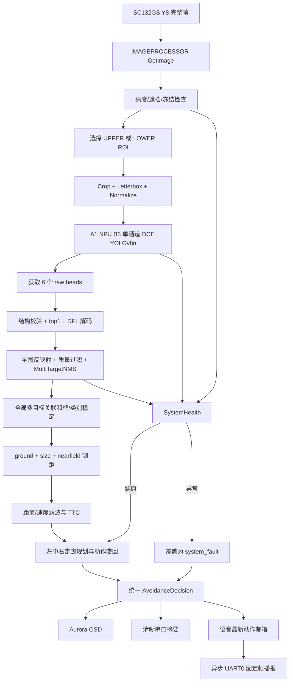

# GrayNav 板端核心代码实现详解

## 1. 文档范围与当前运行基线

本文对应 A1 SDK 中实际参与编译和烧录的工程：

```text
smart_software/src/app_demo/obstacle_detect/ssne_ai_demo
```

当前编译基线由 `CMakeLists.txt` 固定：

| 项目 | 当前值 | 含义 |
|---|---:|---|
| `A1_MODEL_FILENAME` | `graynav_rod25_gray1_dce_b3_head6.m1model` | B3 真单通道输入、DCE 增强、ROD25 微调模型 |
| `A1_YOLO_NUM_CLASSES` | `25` | 三个分类 head 的通道数 |
| `A1_YOLO_INPUT_CHANNELS` | `1` | NPU 输入为真实 Y8 单通道，不复制为 BGR |
| `A1_ENABLE_VOICE` | `ON` | 编译 SYN6288 UART 语音模块 |
| 输入尺寸 | `384 x 384 x 1` | 每次 NPU 推理输入 |
| 传感器画面 | `720 x 1280` | SC132GS Y8 完整画面和 Aurora 坐标系 |
| head6 | `3 x cls + 3 x DFL` | 分类 25 通道，回归 64 通道，stride 8/16/32 |

系统的核心原则是：**单帧检测、时序跟踪、测距、规划和输出分层实现**。神经网络不直接给语音动作；OSD、串口和语音必须消费同一个 `AvoidanceDecision`，避免三处逻辑互相矛盾。

## 2. 目录和代码职责

| 文件 | 核心职责 | 主要符号 |
|---|---|---|
| `demo_obstacle.cpp` | 主程序、模块编排、健康监控、串口摘要 | `main`、`SystemHealth`、`RuntimeMeter` |
| `include/common.hpp` | 全系统共享数据契约 | `DetectionItem`、`DetectionResult`、`AvoidanceDecision` |
| `src/pipeline_image.cpp` | SC132GS 完整 Y8 画面采集与重启 | `IMAGEPROCESSOR` |
| `src/yolov8_gray.cpp` | 双 ROI 预处理、NPU 推理、head6/DFL 解码、NMS 前过滤 | `YOLOV8GRAY` |
| `src/semantic_config.cpp` | ROD25 原始类别到导航语义的映射 | `SemanticClassFromRaw`、`CandidateThreshold` |
| `src/utils.cpp` | 多目标保护式 NMS、结果排序和 OSD 上层绘制 | `MultiTargetNMS`、`VISUALIZER` |
| `src/tracker.cpp` | 多目标关联、框/类别/距离时序稳定 | `ObstacleTracker` |
| `src/ranging.cpp` | 地面投影、尺寸先验、近场上界和不确定度融合 | `RangingEstimator` |
| `src/avoidance_planner.cpp` | 三走廊风险规划和动作滞回 | `AvoidancePlanner` |
| `src/osd-device.cpp` | A1 OSD 图层、DMA 和纹理硬件操作 | `OsdDevice` |
| `src/voice_notifier.cpp` | SYN6288 固定帧、异步发送和持续播报 | `VoiceNotifier` |
| `scripts/run.sh` | 板端默认参数、进程监督重启 | 环境变量和 supervisor 循环 |
| `scripts/run_voice_both.sh` | OSD+语音模式及 UART 接线说明 | 语音运行参数 |

### 2.1 建议阅读顺序与调用边界

理解代码时不要从单个算法文件孤立阅读，建议按实际调用顺序展开：

1. 从 `CMakeLists.txt` 确认本次烧录使用的模型、类别数、输入通道和语音开关；
2. 阅读 `scripts/run.sh`，确认运行参数覆盖了哪些 C++ 默认值；
3. 进入 `demo_obstacle.cpp::main()`，观察各模块的初始化、每帧调用顺序和异常覆盖关系；
4. 沿 `IMAGEPROCESSOR -> YOLOV8GRAY -> ObstacleTracker` 阅读图像、推理和时序处理；
5. 注意 `ObstacleTracker::Update()` 内部继续调用 `RangingEstimator` 和 `AvoidancePlanner`；
6. 最后阅读 `VISUALIZER` 与 `VoiceNotifier`，两者只消费最终结果，不重新做检测或规划。

模块之间的数据所有权约定如下：

| 阶段 | 输入 | 输出 | 不允许做的事 |
|---|---|---|---|
| 采集 | SC132GS | 完整 Y8 tensor | 不在采集端固定裁掉上下视野 |
| 检测 | 完整 Y8 tensor | 全图坐标 `DetectionResult` | 不保留上一帧 raw tensor 充当新结果 |
| 跟踪 | 当前 ROI 检测 | 稳定轨迹 | 不凭空创造模型完全没有响应的类别 |
| 测距 | 当前目标框与类别 | 带方差的距离证据 | 不把 coarse 横框输出为精确米数 |
| 规划 | 稳定目标和保守距离 | 唯一 `AvoidanceDecision` | 不直接控制 UART 或 OSD 硬件 |
| 输出 | 最终决策 | OSD、串口、语音 | 不分别重新推导另一套动作 |

## 3. 全系统共享数据结构

### 3.1 `DetectionItem`

定义位置：`include/common.hpp`。

它不是简单的 YOLO 框，而是一个目标从检测到规划全过程的共享记录：

| 字段组 | 字段 | 谁写入 | 用途 |
|---|---|---|---|
| 几何 | `box` | YOLO 后处理、tracker 平滑 | 完整 720x1280 画面的 `xyxy` 坐标 |
| 分类 | `score/raw_class_id/raw_label` | YOLO 后处理 | 保留模型原始结果，便于诊断 |
| 语义 | `class_id/label/semantic_class/risk_weight` | 语义映射、tracker | 导航层统一语义和风险权重 |
| 方位 | `sector/lateral_m` | 检测器、测距器 | 图像方位和地面横向位置 |
| 测距 | `distance_m/safe_distance_m/sigma/source/confidence` | ranging、tracker | 距离均值、保守下界、不确定度和来源 |
| 时序 | `track_id/age/missed` | tracker | 稳定轨迹编号和生命期 |
| 运动 | `approach_mps/ttc_s/range_measurements` | tracker | 接近速度、碰撞时间和证据数量 |
| 质量 | `quality/risk_level` | 后处理、测距、tracker | `good/low/coarse` 与风险级别 |

最重要的坐标约定：`box` 离开 `YOLOV8GRAY` 后必须已经是完整 Aurora 坐标。tracker、测距、规划和 OSD 不允许再使用 384 模型输入坐标。

### 3.2 `DetectionResult`

除目标数组外，还记录：

- `raw_candidate_count`：通过分类和基本几何检查的候选数；
- `post_nms_count`：多目标 NMS 后目标数；
- `coarse_drop_count`：被饱和横框/粗框策略拒绝的数量；
- `view_id`：本帧来自 UPPER 还是 LOWER ROI；
- `roi`：当前 ROI 在完整画面中的边界；
- `timestamp_ms`：tracker、测距速度和规划滞回使用的统一时间戳。

这些字段同时用于资源异常检测和离线对齐，不只是调试信息。

### 3.3 `AvoidanceDecision`

`left/center/right` 保存三条走廊的最近风险摘要。`action` 只允许：

```text
clear, slow, stop, turn_left, turn_right, system_fault
```

`system_fault` 是健康管理覆盖正常规划时使用的安全动作。OSD 显示异常，串口输出故障字段，语音映射为“异常”。

## 4. 图像采集实现

### 4.1 初始化与完整视野

实现位置：`src/pipeline_image.cpp`，类 `IMAGEPROCESSOR`。

`ConfigureAndOpen()` 创建 A1 online pipeline，输入格式为 `SSNE_Y_8`。默认参数为：

```text
A1_FULL_FRAME_WIDTH=720
A1_FULL_FRAME_HEIGHT=1280
A1_CAPTURE_WIDTH=720
A1_CAPTURE_HEIGHT=1280
A1_CAPTURE_CROP_X0=0
A1_CAPTURE_CROP_Y0=0
```

因此 sensor pipeline 获取完整画面，不再在采集端固定裁掉上半部分。模型 ROI 在离线预处理阶段产生，采集模块不理解模型尺寸。

`GetImage()` 调用 `GetImageData` 获得当前 Y8 tensor。`A1_DUMP_CAPTURE_ONCE=1` 时可将实际采集缓冲保存到 `/tmp`，用于确认 Aurora 画面和模型数据源一致。

### 4.2 采集失败恢复

`Restart()` 先关闭 online pipeline，再重新执行配置和打开。主循环在连续取帧失败时调用它；若长时间恢复失败，进程以指定退出码退出，由 `run.sh` 的 supervisor 退避重启。

## 5. 双 ROI 模型输入

### 5.1 为什么使用双 ROI

传感器画面是竖向 `720x1280`，模型输入是方形 `384x384`。直接把全图压缩到方形会严重改变目标比例；固定裁剪又会永久丢失裁剪外目标。因此 `YOLOV8GRAY::Initialize()` 建立两个重叠方形视图：

```text
UPPER: x=[0,720), y=[0,720)
LOWER: x=[0,720), y=[560,1280)
overlap: 160 px
```

`Predict()` 以 `predict_count_ & 1` 奇偶交替视图，每帧仍只执行一次 NPU 推理。这样扩大垂直视野而不把单帧 NPU 开销翻倍。

### 5.2 letterbox 参数

每个 ROI 独立保存 `LetterboxInfo`：

```text
scale = min(dst_w/src_w, dst_h/src_h)
resize_w = round(src_w * scale)
resize_h = round(src_h * scale)
pad_x = (dst_w - resize_w)/2
pad_y = (dst_h - resize_h)/2
```

A1 离线预处理管线按顺序执行：

1. `SetCrop` 选择当前 ROI；
2. `SetPadding2` 完成等比例缩放和 114 padding；
3. `SetNormalize` 读取 `.m1model` 的量化归一化配置；
4. 输出 `SSNE_Y_8` 的 `384x384x1` tensor。

### 5.3 暗光自适应灰度增强

`apply_adaptive_gray_lut()` 只在平均灰度低于 `A1_ADAPTIVE_GRAY_DARK_MEAN` 且仍有有效纹理时执行 4x4 分块、裁剪直方图均衡和原图混合。正常光照输入保持逐字节不变；极低方差遮挡图不增强，避免把噪声制造成伪纹理。

主要参数：

| 参数 | 默认 | 作用 |
|---|---:|---|
| `A1_ADAPTIVE_GRAY` | 1 | 启用暗光自适应 |
| `A1_ADAPTIVE_GRAY_DARK_MEAN` | 75 | 暗光触发平均灰度 |
| `A1_ADAPTIVE_GRAY_BLEND` | 60 | 均衡结果混合百分比 |
| `A1_ADAPTIVE_GRAY_DIAG` | 1 | 低频输出增强统计 |

### 5.4 坐标反变换

`MapBoxToOriginalImage()` 执行：

```text
x_roi = (x_model - pad_x) / scale
y_roi = (y_model - pad_y) / scale
x_full = x_roi + roi_x0
y_full = y_roi + roi_y0
```

每一步均裁剪到有效范围。任何框偏移或横向拉伸问题都应首先检查这里的 `active_view_`、`scale/pad` 和运行时 head layout。

## 6. A1 NPU 推理与 head6 后处理

### 6.1 模型加载和输入契约

`YOLOV8GRAY::Initialize()` 使用 `ssne_loadmodel(..., SSNE_STATIC_ALLOC)` 加载模型，并调用：

- `ssne_get_model_normalize_params`；
- `ssne_get_model_input_dtype`；
- `create_tensor(384,384,SSNE_Y_8,SSNE_BUF_AI)`。

编译宏与模型不匹配时不能靠后处理补救。B3 模型必须同时满足 1 通道输入和 25 类输出。

### 6.2 单帧推理入口

`YOLOV8GRAY::Predict()` 顺序为：

1. 选择当前 ROI；
2. `Preprocess()`；
3. `ssne_inference(model_id, 1, inputs)`；
4. `ssne_getoutput(model_id, 6, outputs)`；
5. `Postprocess()`；
6. 写入当前 `view_id/roi/timestamp`；
7. 记录 preprocess、inference、output、postprocess 耗时。

### 6.3 六输出结构校验

`Postprocess()` 不假设转换工具返回固定 output 顺序，而是建立 `BranchView` 并按网格和通道配对：

| stride | 网格 | 分类通道 | DFL 通道 |
|---:|---:|---:|---:|
| 8 | 48x48 | 25 | 64 |
| 16 | 24x24 | 25 | 64 |
| 32 | 12x12 | 25 | 64 |

运行时默认按照 HWC 访问 m1model 输出。`A1_MODEL_OUTPUT_LAYOUT=CHW` 仅用于诊断其他转换结果。任意 head 数、通道、stride 或元素数异常时，整帧返回失败并交给 `SystemHealth`，禁止继续解码错位 tensor。

### 6.4 分类扫描和 DFL 解码

每个 anchor 原地扫描 25 个分类 logit，只保存 top-1；同时保留一个满足相对分数条件的 person 备选，减少 person 被相近类别瞬时压过造成的漏检。

概率阈值预先变换成 logit 阈值：

```text
logit_threshold = log(p / (1-p))
```

只有分类通过阈值的 anchor 才计算四条边的 DFL。每条边的 16 个 bin 做 softmax 后取期望：

```text
d = sum(i * softmax(logit_i)), i=0..15
```

以网格中心 `(x+0.5,y+0.5)` 和 stride 解码：

```text
x1 = (anchor_x - left) * stride
y1 = (anchor_y - top) * stride
x2 = (anchor_x + right) * stride
y2 = (anchor_y + bottom) * stride
```

这种“分类先筛选、回归后计算”避免空场景对所有 anchor 执行大量指数运算。

### 6.5 候选质量过滤

`append_candidate` 依次完成语义映射、全图反变换和几何审计，重点拒绝：

- 宽高过小的数值噪声框；
- 面积接近整图的饱和框；
- 同时贴住 ROI 左右边界或上下边界的回归伪框；
- 低置信、横跨画面中部的扁平大框；
- 不符合室内几何的低置信 vehicle，降级为 `generic_obstacle` 而非直接宣称车辆。

框质量分为 `good/low/coarse`。coarse 框不能建立稳定轨迹，也不能输出精确米级距离。

### 6.6 多目标保护式 NMS

`utils::MultiTargetNMS()` 不只看 IoU。它首先按风险、距离、质量和置信度排序，再区分：

- 同一实体的同类重叠框；
- 同 anchor 产生的跨类重复框；
- 横向分离、应同时保留的多个目标；
- 内含可靠小框的 wide/coarse 大框。

默认 `A1_NMS_TOP_K=300` 控制 NMS 前候选，`A1_NMS_KEEP_TOP_K=40` 控制后处理结果，OSD 最多显示 6 个。`suppress_coarse_obstacle_boxes()` 在 NMS 后再次删除会覆盖可靠小框的粗框。

## 7. 类别与阈值配置

实现位置：`src/semantic_config.cpp`。

ROD25 原始类别按模型输出顺序保存，包括 bike、building、car、person、stairs、traffic sign、pole、road、motorcycle、dustbin、dog、manhole、tree、guard rail、crosswalk、truck、bus、bench、cone、fire hydrant、traffic barrel、plant pot、electrical box、chair、bicycle rack。

`road` 被屏蔽；其余类别映射到 8 个导航语义。原始类别仍保存在 `raw_label`，因此串口可追踪模型实际判定，导航输出则使用稳定语义名称。

`CandidateThreshold(raw_class_id)` 控制召回阶段阈值；`RiskWeight(semantic_class_id)` 只参与后处理排序和规划，不修改模型分数。当前 person 候选阈值为 0.08，低于 0.11 的人体轨迹需要至少三次命中才发布。已有 person 轨迹后，位置连续的非 coarse 局部实体框可作为人体部位桥接，维持人体轨迹；该机制不能在网络完全无响应时凭空创建人体。更换模型类别时，应集中修改本文件，并同步 CMake 的 `A1_YOLO_NUM_CLASSES`。

## 8. 多目标跟踪与框稳定

### 8.1 关联代价

`ObstacleTracker::MatchScore()` 组合：

```text
score = 0.52*IoU + 0.28*center_score + 0.12*size_similarity + 0.08*class_score
```

在计算分数前先用位置突变、尺寸突变和 coarse 降级门限拒绝不合理关联。`Update()` 建立所有 track-detection 候选边，按分数全局降序匹配，并确保一对一关系，减少多人场景 ID 交换。

### 8.2 框平滑

`UpdateTrack()` 根据归一化中心位移自适应选择旧框权重：静止目标平滑更强，快速移动目标更依赖新框；高置信检测进一步降低旧框权重。因此框稳定不以明显拖尾为代价。

### 8.3 类别证据

每条轨迹维护长度等于模型类别数的 `class_evidence`。旧证据每帧乘 0.92，新类别加当前置信度；只有新最优证据超过当前证据 1.2 倍才切换类别。这里已经动态使用 25 类，不再保留 COCO 80 类硬编码。

### 8.4 轨迹创建和删除

- 一般目标分数至少 0.22；person 可放宽到 0.08；
- bench/chair 可放宽到 0.16，dustbin/electrical box 为 0.18，barrel/rack 为 0.20；
- coarse 或不合理宽框不能创建轨迹；
- 低置信轨迹至少命中 2 次才发布；
- person 低于 0.11 时至少命中 3 次才发布；
- 仅当前 ROI 覆盖的轨迹未匹配时才增加 `missed`；
- 当前可见 ROI 内连续丢失超过 1 次即删除，或最后观测超过 700ms 删除；
- 非当前 ROI 的轨迹最多短暂保留约 250ms，保留期间不允许形成长期残留框。

## 9. 单目测距实现

实现位置：`src/ranging.cpp`。输入必须是 tracker 前的全图目标框；输出随后由 tracker 做时序滤波。

### 9.1 相机内参近似

由完整画面宽高与 FOV 计算：

```text
fx = W / (2*tan(FOV_h/2))
fy = H / (2*tan(FOV_v/2))
```

当前装机参数：`FOV_h=49.7°`、`FOV_v=78.9°`、相机高度 `0.71m`、向下俯仰 `15°`。这些值在 `scripts/run.sh` 中可覆盖；高度和俯仰已按本轮实机安装值更新，FOV 仍建议通过标定板复核。

### 9.2 地面交点证据

`GroundEstimate()` 使用框底部中心像素构造相机射线，经俯仰旋转后与地平面求交。只有射线向下、交点在 0.2--8m、框底部具有地面接触可信度时才有效。其不确定度随距离和框底部质量增大。

### 9.3 类别尺寸先验

当前 25 类模型为 person、dustbin、bench、traffic barrel、plant pot、chair 提供物理尺寸均值和相对标准差。完整目标使用：

```text
z_size = fy * H_real / h_pixel
```

局部 person 框先根据地面投影距离反推“完整人体在当前距离下应有的像素高度”。若实际框高不足期望高度的 52%，则判定框底不能代表脚底，禁用该次 ground estimate，并按框宽高比分别使用约 0.18m 头宽、0.42m 肩宽或 0.28m 窄身体/腿部宽度先验。局部人体先验赋予 32%~45% 的较大相对方差。尺寸先验不是精确常数，代码始终同时产生 `mean` 和 `sigma`。

地面投影不再把框底 `y2` 直接当接地点，而是减去受限的框高比例偏移，补偿 YOLO 回归框在目标下方的 padding。距离方差由 `z=h/tan(theta)` 对底边像素的雅可比传播得到，远场小俯角下方差会自动增大。为抑制人体框在“全身框/上半身框/头像框”之间切换造成的距离突跳，tracker 对 2m 以上测量使用最近 3~5 次逆深度中值，并对突然变远的单帧测量先保持预测距离；突然变近的测量立即接纳。

### 9.4 近场上界

框底靠近图像底部且面积较大时，`NearFieldUpperBound()` 给出 0.45/0.70/1.00m 级别的距离上界。它不是精确测量。贴住左右边界、宽度超过 90% 或 coarse 框不允许触发该规则，避免横框制造虚假 0.45m 紧急距离。

### 9.5 不确定度融合

地面法与尺寸法的归一化残差：

```text
r = |zg-zs| / sqrt(sigma_g^2 + sigma_s^2)
```

当 `r <= 2.5` 时按逆方差融合：

```text
w = 1/sigma^2
z = (wg*zg + ws*zs)/(wg+ws)
sigma = sqrt(1/(wg+ws))
```

冲突时保留地面证据并扩大 1.35 倍方差。规划使用：

```text
safe_distance = clamp(mean - sigma, 0.2, 8.0)
```

### 9.6 距离时序与 TTC

`ObstacleTracker::UpdateRangeState()` 维护距离和径向速度。先按真实时间差预测，再按测量置信度调整 alpha、beta。至少累计 3 次可靠测量且接近速度大于 0.08m/s 后才计算：

```text
TTC = safe_distance / approach_speed
```

默认风险阈值为：TTC 小于 1.40s 或安全距离小于 0.85m 为 urgent；小于 1.25m 为 near；小于 2.20m 为 warning；否则 far。侧方走廊必须大于 1.45m 才视为可绕行，并要求候选方向比另一侧至少多 0.25m 净空。所有阈值通过 `A1_RANGE_*`、`A1_TTC_STOP_S`、`A1_SIDE_CLEAR_M` 和 `A1_TURN_MARGIN_M` 环境变量统一覆盖。

## 10. 三走廊避障规划

实现位置：`src/avoidance_planner.cpp`。

### 10.1 走廊更新

目标按 `lateral_m` 和 `sector` 分配到 left/center/right。每条走廊保存最近保守距离和最小 TTC。可靠 wide 目标同时影响三条走廊；coarse/低置信 wide 目标只增加不确定性，不允许单独触发全域 STOP。

上下两个 ROI 在最近 500ms 内均被观察时，三条走廊标记为 `verified`。该标志只用于“中央受阻后选择哪一侧安全走廊”；若障碍明确位于单独一侧，系统会立即给出向相反方向转向的建议，不等待双 ROI 验证。

### 10.2 动作规则

| 条件 | 动作 |
|---|---|
| 可靠 wide 近障、中心 TTC 过短、中心近障且无已验证可绕行侧 | `stop` |
| 仅右侧近障/警告 | 立即 `turn_left` |
| 仅左侧近障/警告 | 立即 `turn_right` |
| 中心或右侧受阻，左侧已验证且净空明显更大 | `turn_left` |
| 中心或左侧受阻，右侧已验证且净空明显更大 | `turn_right` |
| 多侧风险、低质量不确定障碍或只有 warning 且方向不明确 | `slow` |
| 连续确认无可靠风险 | `clear` |
| 任一系统健康故障 | 主循环覆盖为 `system_fault` |

中央受阻后的候选侧方走廊要求净空大于 `1.45m`，且比另一侧至少多 `0.25m`。这一严格条件不限制“单独侧方障碍直接反向转向”的快速规则。

### 10.3 动作滞回

`StabilizeAction()` 规则：

- `stop/system_fault` 立即生效；
- `slow` 风险升级快速生效；
- 普通动作至少连续 2 次确认；
- 左右反转稳定 300ms；
- STOP 解除至少 500ms；
- CLEAR 稳定 700ms。

## 11. OSD 实现

`VISUALIZER` 位于 `src/utils.cpp`，硬件封装 `OsdDevice` 位于 `src/osd-device.cpp`。

五层约定：

| 层 | 类型 | 内容 |
|---:|---|---|
| 0 | quadrangle | 已停用的旧风险条，当前保持为空 |
| 1 | RLE image | STOP/SLOW/LEFT/RIGHT/CLEAR |
| 2 | RLE image | C_NEAR、L_WARN、WIDE_NEAR 等辅助信息 |
| 3 | quadrangle | 预留层，当前保持为空 |
| 4 | quadrangle | 最多 6 个检测框 |

检测框层每次绘制前清空，因此目标消失不会留下旧框。动作和信息纹理只在资源名变化时刷新，以降低 OSD DMA 操作。若某个纹理层加载失败，本次运行禁用该层，避免每帧失败拖慢检测。

## 12. UART 语音实现

### 12.1 硬件和初始化

生产路径为：

```text
A1 P4 pin15 / D0 UART0TX -> 1.8V/3.3V 电平转换 -> SYN6288 RXD
A1 P4 pin16 / D2 UART0RX <- 1.8V/3.3V 电平转换 <- SYN6288 TXD
GND 共地
```

`OpenA1UartApi()` 调用 GPIO API 把 PIN0/PIN2 复用为 UART_TX0/RX0，再使用 UART API 设置 9600 baud、8N1、无校验。

### 12.2 主线程与工作线程

`VoiceNotifier::Update()` 不发送 UART，只把最新 `frame_id/action` 写入互斥保护的邮箱并通知工作线程。邮箱只有一个槽位，新动作覆盖未发送旧动作。

`WorkerLoop()` 执行：

1. 接收并解析可选状态字节；
2. 处理当前事务完成/超时；
3. 读取最新动作；
4. 当前事务完成后根据优先级和重复周期发送；
5. 异常和 STOP 优先于普通动作。

这样语音耗时不会阻塞图像、NPU 和 OSD。

### 12.3 SYN6288 数据帧

动态文本帧格式由 `BuildSyn6288Frame()` 生成：

```text
FD | length_hi | length_lo | 01 | parameter | GBK payload | XOR checksum
```

当前生产模式 `A1_VOICE_FIXED_FRAME=1`，`BuildFixedPromptFrame()` 直接返回已核验的六个短词帧：直行、减速、停下、左转、右转、异常，消除板端 GBK 转码差异。

`SendBytes()` 使用持久 UART 句柄并默认逐字节发送，字节间隔 2000us，帧后等待 30ms。该节拍是当前 A1 UART 驱动和 SYN6288 载板的实测稳定配置。

### 12.4 持续播报和异常优先级

默认重复周期：

| 动作 | 周期 |
|---|---:|
| clear | 1200ms |
| slow/left/right | 1200ms |
| stop | 1600ms |
| system_fault | 1800ms |

动作优先级：`system_fault > stop > left/right > slow > clear`。故障解除后额外保持 `A1_VOICE_FAULT_HOLD_MS=2500`，避免遮挡边缘暂时露光时穿插“直行”。

生产脚本关闭强制 ACK 和主动 busy 查询，因为部分 SYN6288 载板回传不稳定；工作线程用短词确定性时长完成事务，同时被动读取 0x41/0x45/0x4A/0x4E/0x4F 做统计。只有真正 UART 发送失败才重开后端。

## 13. 健康监控与异常恢复

`SystemHealth` 位于 `demo_obstacle.cpp`。

### 13.1 摄像头/数据异常

检测证据：连续取帧失败、黑色遮挡、强过曝、极低方差纯色、多帧采样哈希不变，以及由全图/中心区域动态范围、纹理和边缘联合得到的遮挡分数。默认连续 3 帧达到遮挡分数门限后锁存 `state=sensor`，正常决策被替换为 `system_fault`；恢复要求连续 18 帧全部健康。对应参数为 `A1_COVER_SCORE_THRESHOLD`、`A1_COVER_TRIGGER_FRAMES` 和 `A1_COVER_RECOVERY_FRAMES`。

### 13.2 推理异常

`ssne_inference`、`ssne_getoutput` 或 head6 契约校验失败均使 `Predict()` 返回 false。连续 2 次进入 `state=ai`；持续 30 次则退出进程，由 supervisor 重启。

### 13.3 资源异常

检测低平均 FPS、高 P95、可用内存低于 8192KB、原始候选连续超过 1400。故障动作同样为 `system_fault`。运行摘要由 `RuntimeMeter` 统计最近 120 个帧周期。

### 13.4 可复现异常注入

`A1_TEST_FAULT_TYPE=camera|inference|resource` 配合起始帧和持续帧数，只注入健康证据，不损坏模型或真实资源，用于验收串口、OSD、语音和恢复闭环。

## 14. 主循环完整时序

`demo_obstacle.cpp::main()` 的每帧执行顺序如下：



关键控制关系：

1. 捕获失败时不执行推理，直接进入保护路径；
2. 推理失败时不使用上一帧 raw 结果；
3. 健康状态正常时，tracker 内部依次完成测距和规划；
4. 健康异常时，主循环覆盖 planner 动作为 `system_fault`；
5. OSD、串口和语音接收同一个最终决策；
6. 语音 UART 工作线程不阻塞主循环；
7. 正常退出时按语音、OSD、模型、采集顺序释放资源。

## 15. 参数修改索引

### 15.1 编译期参数

位置：`CMakeLists.txt`。

- 模型文件：`A1_MODEL_FILENAME`；
- 分类数：`A1_YOLO_NUM_CLASSES`；
- 输入通道：`A1_YOLO_INPUT_CHANNELS`；
- 语音编译开关：`A1_ENABLE_VOICE`。

四者必须与转换后的 m1model 同步。CMake 安装规则只打包当前模型，历史 `.m1model` 不进入 initramfs，以满足 16MB 烧录限制。

### 15.2 运行期参数

默认值集中在 `scripts/run.sh` 和 `scripts/run_voice_both.sh`：

- 视野：`A1_CAPTURE_*`、`A1_DUAL_ROI`、`A1_ROI_UPPER_Y/LOWER_Y`；
- 后处理：`A1_NMS_TOP_K/KEEP_TOP_K`、`A1_MODEL_OUTPUT_LAYOUT`；
- 相机标定：`A1_CAM_FOV_H_DEG`、`A1_CAM_FOV_V_DEG`、`A1_CAM_HEIGHT_M`、`A1_CAM_PITCH_DOWN_DEG`；
- 暗光：`A1_ADAPTIVE_GRAY_*`；
- 输出：`A1_OUTPUT_INTERVAL_FRAMES`、`A1_OSD_INTERVAL_FRAMES`、`A1_OUTPUT_SERIAL_DIAG`；
- 语音：`A1_VOICE_*`；
- 异常测试：`A1_TEST_FAULT_TYPE/START_FRAME/DURATION_FRAMES`。

### 15.3 算法内部阈值

| 阈值类型 | 位置 |
|---|---|
| ROD25 各类候选阈值、风险权重 | `src/semantic_config.cpp` |
| 饱和横框、coarse 和几何过滤 | `src/yolov8_gray.cpp` |
| NMS 跨类重复与小框保护 | `src/utils.cpp` |
| tracker 匹配、确认、丢失和框平滑 | `src/tracker.cpp` |
| 尺寸先验、融合残差、近场上界 | `src/ranging.cpp` |
| 走廊净空、TTC、动作滞回 | `src/avoidance_planner.cpp` |
| 遮挡、推理、资源异常门限 | `demo_obstacle.cpp::SystemHealth` |

调整参数时应一次只改变一个模块，并同时保存串口性能摘要和现场场景，避免用后处理阈值掩盖模型或量化错误。

## 16. 启动、监督与烧录后行为

`run.sh` 先导出全部默认参数，再执行 `ssne_ai_demo`。非零退出时 supervisor 最多重启 5 次，并使用递增秒数退避；正常退出码 0 不重启。

开发板启动后的完整行为为：

1. 内核和驱动加载；
2. 脚本设置参数并启动程序；
3. SSNE、相机、模型、OSD、UART 依次初始化；
4. 首帧打印模型路径、输入通道和六个 head 元数据；
5. 主循环持续检测、跟踪、测距和规划；
6. Aurora 显示框与动作，串口低频输出人可读摘要；
7. SYN6288 按最新动作持续播报；
8. 发生异常时统一 STOP 保护、显示故障并播报“异常”；
9. 异常消失并满足连续健康帧后，恢复正常避障指引；
10. 严重采集/推理故障无法恢复时，进程退出并由脚本自动重启。

## 17. 修改代码时必须保持的接口不变量

1. `DetectionItem::box` 始终是完整画面坐标；
2. B3 模型必须是 1 输入通道、25 类、3 个 64 通道 DFL head；
3. 只有 `semantic_config.cpp` 定义原始类别映射；
4. 只有 planner 产生正常动作，只有 SystemHealth 可覆盖为 `system_fault`；
5. OSD、串口和语音不得各自重新计算动作；
6. coarse 框不得输出伪精确距离或单独触发全域 STOP；
7. 中央阻塞时只有已验证侧方走廊可用于选择 LEFT/RIGHT；单独侧方障碍可立即提示向反方向转向；
8. UART 发送不得在推理主线程执行；
9. 历史模型不得被 CMake 安装进最终镜像；
10. 更换 m1model 后必须重新验证输入通道、类别数、head shape/layout 和 Python/C++ 解码一致性。

## 18. 逐文件关键函数说明

本节用于从函数层面定位实现。行号会随修改变化，因此以“文件 + 符号名”为稳定索引。

### 18.1 `demo_obstacle.cpp`：系统编排和安全闭环

| 符号 | 输入/状态 | 实现职责 |
|---|---|---|
| `env_flag_enabled/env_int_value/env_float_value/env_string_value` | 环境变量 | 读取运行参数并实施上下界保护，防止脚本错误值破坏算法 |
| `analyze_light_stats` | 完整 Y8 tensor | 以步长采样计算均值、方差、暗/亮比例、分位动态范围、边缘比例、中心区域统计和帧哈希 |
| `SystemHealth::UpdateData` | `LightStats` | 累计遮挡和冻结证据；遮挡计数封顶，恢复计数独立 |
| `SystemHealth::UpdateResource` | FPS/P95/候选数 | 检测低帧率、低内存和候选爆炸 |
| `SystemHealth::RefreshState` | 所有异常计数 | 锁存故障、连续健康恢复，并生成 `sensor/ai/resource` 与具体原因 |
| `SystemHealth::SafeDecision` | 当前故障 | 生成最高优先级 `system_fault`，不允许普通 planner 覆盖 |
| `print_human_packet` | 稳定结果和最终决策 | 输出速度、方向、障碍物、距离、风险五个可读字段 |
| `print_fault_packet` | `SystemHealth` | 输出故障类型、原因、STOP 保护、异常语音和自动恢复策略 |
| `main` | 全系统 | 初始化、逐帧编排、异常覆盖、输出、释放和退出码管理 |

`main()` 中最重要的顺序约束是：必须先得到健康状态，再决定是否把 planner 结果覆盖为 `system_fault`；OSD、串口和语音都在覆盖之后消费同一个 `health_decision`。如果把语音更新提前，遮挡期间就可能继续播报“直行”。

### 18.2 `pipeline_image.cpp`：传感器完整帧

| 符号 | 关键行为 |
|---|---|
| `IMAGEPROCESSOR::ConfigureAndOpen` | 配置输入宽高、裁剪起点、Y8 格式、online pipeline 和可选首帧 dump |
| `IMAGEPROCESSOR::GetImage` | 从 pipeline 取得当前 sensor tensor，并检查宽、高和数据有效性 |
| `IMAGEPROCESSOR::Restart` | 关闭并重新建立 pipeline，供连续采集失败时自动恢复 |
| `IMAGEPROCESSOR::Release` | 成对释放图像和 pipeline 资源 |

采集模块输出的是完整 `720x1280` 画面。模型的 UPPER/LOWER 选择只能发生在 `YOLOV8GRAY::Preprocess()`，否则 Aurora 坐标、遮挡检测和双 ROI 跟踪都会失去共同参考系。

### 18.3 `yolov8_gray.cpp`：模型前后处理

| 符号 | 关键行为 |
|---|---|
| `YOLOV8GRAY::Initialize` | 加载 m1model、读取归一化参数、创建 1 通道输入 tensor、建立双 ROI、校验编译契约 |
| `apply_adaptive_gray_lut` | 只在暗光且仍有纹理时执行 4x4 局部均衡和受限混合 |
| `YOLOV8GRAY::Preprocess` | 选择 ROI，执行 crop、letterbox、114 padding、模型 normalize 和可选增强 |
| `make_branch_view` | 将 A1 输出 tensor 包装为无拷贝 HWC/CHW 访问视图 |
| `pair_head_branches` | 按网格和通道自动配对 25 类 head 与 64 通道 DFL head |
| `validate_paired_heads` | 强制验证 48/24/12 网格、stride 8/16/32、元素数和布局 |
| `decode_dfl_side` | 对单边 16 个 bin 做稳定 softmax 和期望解码 |
| `YOLOV8GRAY::MapBoxToOriginalImage` | 去 padding、除 scale、加 ROI 原点并裁剪到全图 |
| `YOLOV8GRAY::Postprocess` | 分类预筛、按需 DFL、语义映射、几何审计、NMS 和粗框抑制 |
| `YOLOV8GRAY::Predict` | 交替视图，依次调用预处理、NPU、取 6 输出和后处理，并记录各阶段耗时 |

检测器内仍保留少量距离辅助函数，用于候选质量和串口诊断；最终进入规划的距离会在 `ObstacleTracker::Update()` 中由独立 `RangingEstimator::Estimate()` 重新计算。调整正式测距算法时应修改 `ranging.cpp`，不能只改检测器中的辅助估算。

### 18.4 `semantic_config.cpp`：类别唯一真源

该文件保存三类内容：

1. 25 个 head 通道对应的 ROD25 原始标签顺序；
2. 原始类到 8 个导航语义的映射和 `road` 屏蔽规则；
3. 候选阈值、风险权重、距离阈值、走廊边界和宽框比例的运行参数入口。

`RawLabel()` 用于诊断模型原始输出；`SemanticLabel()` 用于导航显示；两者不能混用。比如室内模型错误输出 car 时，可保留 `raw=car` 供排查，同时将动作层按 `vehicle/bicycle` 或通用实体风险处理，而不是伪造模型识别结果。

### 18.5 `utils.cpp` 与 `osd-device.cpp`：NMS 和 Aurora 输出

`MultiTargetNMS()` 先按风险、距离、质量和置信度排序，再调用 `should_suppress_for_multi_nms()` 判断是否同一实体。其特殊规则保护横向分离目标和粗框内部的小框，解决“多人/多椅子被一个大横框吞掉”的问题。

`VISUALIZER::Draw()` 只从稳定结果选择最多 6 个框；每次刷新先清空 layer 4，再画本帧框。动作与风险文字通过 `.ssbmp` 资源加载到 layer 1/2。`OsdDevice` 负责 LUT、DMA、RLE 图像层和 quadrangle 层的实际 A1 API 调用，上层不直接操作硬件句柄。

### 18.6 `tracker.cpp`：从瞬时框到稳定目标

`ObstacleTracker::Update()` 是后处理的时序入口，顺序固定为：

```text
当前检测测距
  -> 枚举全部 track-detection 关联边
  -> 按 MatchScore 全局降序做一对一匹配
  -> 更新已匹配轨迹
  -> 老化当前 ROI 中未匹配轨迹
  -> 为剩余合格检测创建新轨迹
  -> 发布稳定结果
  -> 调用 AvoidancePlanner
```

`IsPersonPartBridge()` 仅在已有 person 轨迹时，将空间连续的腿部、手部或躯干候选作为维持证据；它不能在模型完全没有人体响应时创建 person。`UpdateRangeState()` 对距离和径向速度做真实时间步长滤波，并在远场使用逆深度中值抑制单帧跳远。`RebuildStableResult()` 决定哪些轨迹真正允许绘制和规划，是控制伪框与残留框的最后一道门。

### 18.7 `ranging.cpp`：带不确定度的单目测距

| 符号 | 输出证据 |
|---|---|
| `GroundEstimate` | 地面交点均值、由像素误差传播得到的 sigma、横向位置 |
| `SizeEstimate` | 类别尺寸或局部人体宽度先验的均值和 sigma |
| `NearFieldUpperBound` | 近场距离上界，不是精确测量 |
| `Estimate` | 证据一致性检查、逆方差融合、保守距离和风险等级 |

正式规划使用 `safe_distance_m = mean - sigma`。因此同样的均值下，框底不可靠、远场俯角小或类别尺寸变化大的目标会得到更小的保守距离或更低置信度，系统不会把不确定测量包装成虚假的高精度米数。

### 18.8 `avoidance_planner.cpp`：唯一正常动作产生器

`IsActionHazard()` 先屏蔽 road，并要求 building、traffic sign、pole、tree、electrical box 等场景结构具有近场几何证据。`AddToCorridor()` 将每条走廊压缩成最近距离、最小 TTC 和主风险目标。`Update()` 生成期望动作，`StabilizeAction()` 再完成风险升级、方向反转和风险解除的时间滞回。

普通动作只能由此模块产生。任何检测、测距、OSD 或语音代码都不得自行把某个类别直接翻译为 LEFT/RIGHT/STOP，否则现场调参会出现多套互相冲突的策略。

### 18.9 `voice_notifier.cpp`：非阻塞持续播报

| 符号 | 职责 |
|---|---|
| `InitializeFromEnv` | 读取模式、波特率、节拍、重复周期和保持时间，打开 UART 并启动工作线程 |
| `BuildFixedPromptFrame` | 为六个已验证短词返回固定 SYN6288 帧 |
| `Update` | 将最新动作写入单槽邮箱；故障解除后实施 fault hold，STOP/转向后实施 follow-up hold |
| `WorkerLoop` | 持续处理邮箱、发送事务、被动 RX 和超时，不阻塞主线程 |
| `ShouldSend` | 判断动作变化、重复冷却和保持门控后是否应发送 |
| `StartProtocolSpeech` | 建立一次 in-flight 语音事务并发送固定帧 |
| `HandleProtocolTimeouts` | 在回传缺失或异常时用短语时长结束事务，保证状态机继续前进 |
| `RecoverProtocol/ReopenBackend` | 仅在真实 UART 发送故障时关闭并重开后端 |
| `Release` | 通知线程退出、join 工作线程并关闭 UART |

当前生产配置不依赖 BUSY GPIO，也不把 ACK 作为持续播报的硬门槛。发送使用持久 UART 句柄和逐字节节拍，邮箱只保存最新动作，避免盲人听到已经过期的转向指令。

## 19. 修改参数时的定位原则

1. 目标根本未进入模型：检查完整帧、双 ROI、letterbox 和暗光输入，不先调 NMS；
2. raw head 有目标但没有候选：检查 `semantic_config.cpp` 候选阈值和 head layout；
3. 候选有但 NMS 后消失：检查 `MultiTargetNMS()` 与 saturated/coarse 过滤；
4. NMS 后有但 Aurora 不显示：检查 tracker 命中次数、当前 ROI 可见性和 OSD layer 4；
5. 框稳定但距离错误：检查相机高度/俯仰/FOV、ground/size 证据和 `distance_source`；
6. 距离正确但动作错误：只检查 corridor 分类、阈值和 planner 滞回；
7. 串口动作正确但语音错误：只检查 `VoiceNotifier` 邮箱、保持时间、固定帧和 UART 事务；
8. 异常期间仍播正常动作：检查 `SystemHealth` 覆盖是否发生在三种输出之前。

这种分层定位方式能避免通过降低检测阈值来修复测距，或通过语音冷却掩盖规划抖动。每次调整应同时记录 raw 类别、稳定 track、距离来源、planner reason 和最终 action，才能判断问题真正属于哪一层。
