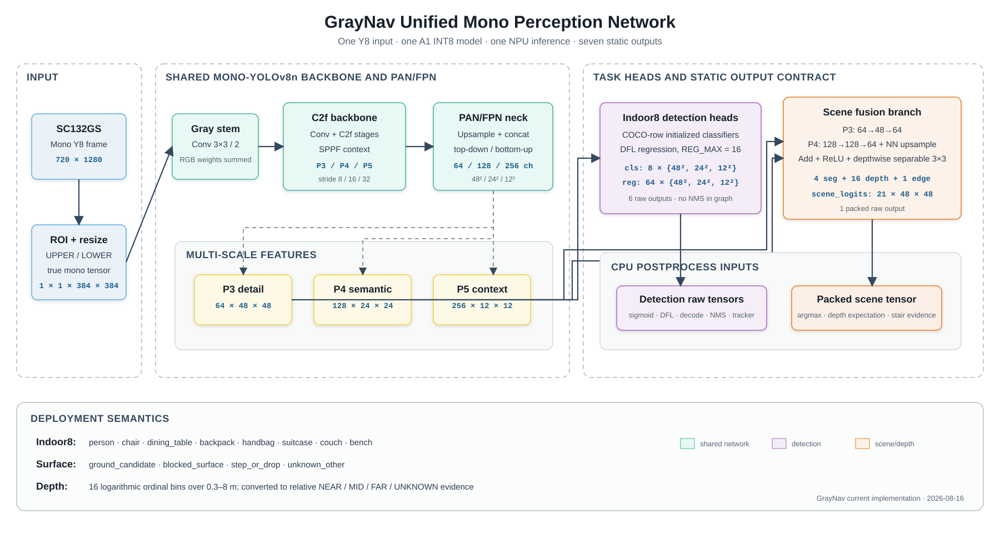
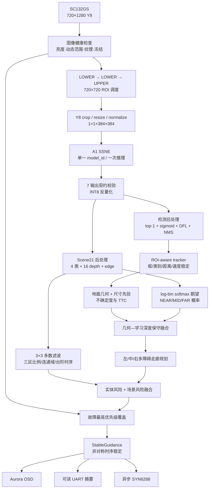

# GrayNav 当前统一模型、系统后处理与单目测距原理

日期：2026-08-16

适用版本：当前已完成实板测试的单模型 Indoor8 + Scene21 系统

统一模型：`graynav_unified_indoor8_scene21.m1model`
模型 SHA256：`33EEC832710706B1153F468F219C08389A52BA3D21CBDFFCDE32CA5E25D66DA8`

> 本文描述的是当前源码和已烧录候选的实际实现，不是早期 ROD25、双模型或独立
> SurfaceDepth 方案。系统是科研与演示原型；串口米数属于未完成物理标定的单目融合
> 估计，不应表述为厘米级真实距离，也不能作为无人陪同出行的唯一安全依据。

## 1. 系统定位与核心思想

GrayNav 使用 SC132GS 单通道灰度相机和 Flyingchip A1 NPU，在一个统一网络中同时完成：

1. 室内常见障碍物检测；
2. 地面、阻挡面、台阶/落差和未知区域的像素级理解；
3. 16 级相对深度预测；
4. 台阶水平危险边缘预测。

网络只负责生成原始空间证据。CPU 端再完成 DFL 解码、NMS、跟踪、几何测距、学习
深度尺度修正、台阶多证据确认、三走廊规划和状态稳定。最终 Aurora、串口和 SYN6288
共同消费同一份 `StableGuidance`，从而避免三个输出端给出互相矛盾的动作。

系统的关键设计不是“用一个类别代替所有危险”，而是把两种互补感知统一起来：

- **实体级感知**回答“人、椅子、桌子、包在哪里”；
- **场景级感知**回答“地面是否可能通行、前方是否被阻挡、是否存在台阶边缘”；
- **几何与相对深度**回答“风险大致处于什么距离层次、是否正在接近”。

## 2. 当前模型架构

### 2.1 科研风格总图



**图 1　GrayNav 统一单通道多任务网络。** 网络以 Mono-YOLOv8n 的 backbone 与
PAN/FPN 为共享特征提取器；P3/P4/P5 生成三尺度 Indoor8 原始检测头，P3 细节与 P4
语义融合后生成一个打包的 Scene21 输出。七个张量来自一次 NPU 推理，并不代表七个模型。

### 2.2 输入与单通道首层

传感器输出完整竖幅 `720×1280` Y8 图像。系统从完整画面截取一个 `720×720` ROI，
缩放到 `384×384`，形成：

```text
images: 1 × 1 × 384 × 384
```

模型不是把灰度复制为三通道。官方 COCO YOLOv8n 的 RGB 首层卷积权重按下式折叠：

\[
W_{gray}=W_R+W_G+W_B.
\]

若灰度值同时送入原 RGB 三个通道，则原卷积响应为
\(W_RI+W_GI+W_BI\)。因此求和折叠在数学上保持该响应，同时把输入真正变成单通道，
避免三通道复制带来的带宽和算力浪费。实现见
[`graynav_unified_perception.py`](../model_optimization/unified/graynav_unified_perception.py)。

### 2.3 共享 Mono-YOLOv8n 主干与颈部

共享网络保留 YOLOv8n 的主要层级：

```text
gray stem
→ Conv/C2f backbone
→ SPPF context
→ PAN/FPN top-down + bottom-up fusion
→ P3 / P4 / P5
```

在 `384×384` 输入下，三个输出尺度分别为：

| 特征 | stride | 空间尺寸 | 主要作用 |
|---|---:|---:|---|
| P3 | 8 | `48×48` | 小目标、边缘和局部人体细节 |
| P4 | 16 | `24×24` | 中等目标与室内结构语义 |
| P5 | 32 | `12×12` | 大目标和全局上下文 |

P5 原始检测分支的首层不满足 A1 的卷积参数限制，因此加入 `1×1, 256→128` 适配器，
随后复用预训练 P4 分支。这个适配器采用单位映射式初始化，而不是无约束随机初始化。

### 2.4 Indoor8 检测分支

检测类别顺序固定为：

```text
0 person        1 chair          2 dining_table   3 backpack
4 handbag       5 suitcase       6 couch          7 bench
```

三个尺度分别输出 8 通道分类 logits 和 64 通道 DFL 回归 logits。`REG_MAX=16`，每条
边使用 16 个离散概率 bin，因此四条边共有 `4×16=64` 个通道。部署图不包含 box decode
和 NMS。

对某个尺度、网格位置 \((i,j)\) 和边 \(s\)，CPU 先计算：

\[
p_{s,k}=\operatorname{softmax}(r_{s,k}),\qquad
\hat d_s=\sum_{k=0}^{15} k p_{s,k}.
\]

再根据 stride 把四个期望距离转换为输入图坐标，例如：

\[
x_1=(j+0.5-\hat d_l)s,\qquad
x_2=(j+0.5+\hat d_r)s.
\]

分类 logits 在 CPU 做 sigmoid，每个 anchor 只保留真实 top-1 类别。之后才执行反
letterbox、ROI 偏移、质量过滤、NMS 和嵌套框抑制。

### 2.5 P3/P4 场景融合分支

场景分支使用高分辨率 P3 保留边缘细节，同时引入 P4 的语义信息：

```text
P3 64×48×48 → 1×1 Conv 64→48 → 1×1 Conv 48→64 ┐
                                                    Add → ReLU
P4 128×24×24 → 1×1 Conv 128→128 → 1×1 Conv 128→64
                                      → nearest 2× ↑ ┘
→ depthwise separable 3×3 refinement
→ segmentation head / ordinal-depth head / stair-edge head
→ channel concat
```

最终打包为：

```text
scene_logits: 1 × 21 × 48 × 48

channels  0..3   ground_candidate / blocked_surface /
                  step_or_drop / unknown_other
channels  4..19  16 个对数间隔相对深度等级
channel   20     stair_edge
```

场景兼容层、分割头和深度头从已训练的 SurfaceDepth E3 epoch49 权重导入；台阶边缘头
由 E3 的 `step_or_drop` 权重初始化。检测骨干和检测头来自官方 COCO 权重，不是从随机
权重开始训练。最终选择的是统一训练的 epoch29 `best_safety` checkpoint。

### 2.6 静态输入输出契约

| order | 张量 | 形状 | 含义 |
|---:|---|---|---|
| input | `images` | `1×1×384×384` | 真单通道灰度输入 |
| 0 | `cls_p3` | `1×8×48×48` | stride-8 分类 logits |
| 1 | `reg_p3` | `1×64×48×48` | stride-8 DFL logits |
| 2 | `cls_p4` | `1×8×24×24` | stride-16 分类 logits |
| 3 | `reg_p4` | `1×64×24×24` | stride-16 DFL logits |
| 4 | `cls_p5` | `1×8×12×12` | stride-32 分类 logits |
| 5 | `reg_p5` | `1×64×12×12` | stride-32 DFL logits |
| 6 | `scene_logits` | `1×21×48×48` | 分割、深度、台阶边缘 |

板端按完整 shape、元素数、数据类型和输出顺序进行硬校验。任何一个张量不符合契约，
该次统一感知结果整体无效，不允许继续使用过期路况或深度。正式 A1 INT8 模型大小为
`4,150,950 bytes`，所有七个输出的官方整体余弦相似度均大于 `0.94`。转换证据见
[`GRAYNAV_UNIFIED_BOARD_BUILD_EVIDENCE_2026-08-13.md`](GRAYNAV_UNIFIED_BOARD_BUILD_EVIDENCE_2026-08-13.md)。

## 3. 系统总体架构



### 3.1 图像采集与 ROI 调度

- 完整采集坐标系为宽 `720`、高 `1280`；检测框始终映射回该完整坐标系。
- UPPER ROI 为 `y=0..719`，LOWER ROI 为 `y=560..1279`，重叠 160 像素。
- 调度顺序为 `LOWER → LOWER → UPPER`。每帧仍只运行同一个模型一次。
- 检测输出每次都使用；场景、深度和台阶时序只由 LOWER 更新，避免上方墙面或人体
  纹理污染地面判断。
- 默认关闭自适应灰度 LUT；只有后续暗光专项测试时才建议受控开启。

### 3.2 检测解码与候选过滤

1. 校验三组分类/回归头的 channel 与 grid；
2. 分类 sigmoid，统一 Indoor8 每个 anchor 只保留 top-1；
3. 只为超过类别候选阈值的 anchor 计算 DFL softmax；
4. 按 P3/P4/P5 stride 解码 box；
5. 去除 letterbox padding，除以 scale，再加当前 ROI 的原点；
6. 拒绝非有限值、极端宽框、ROI 饱和框和低质量 coarse 框；
7. 多目标 NMS 后，再抑制同类嵌套重复框。

统一模型候选阈值为：person `0.12`；chair/table/couch/bench `0.16`；bag 类 `0.18`。
NMS IoU 为 `0.60`，解码前 top-k 为 `300`，NMS 后内部最多 `40`；最终跟踪结果最多保存
8 个稳定目标，Aurora 最多绘制 2 个框。

### 3.3 ROI 感知多目标跟踪

跟踪器使用 IoU、归一化中心距离、框形状相似度和类别一致性进行关联。Indoor8 禁止
旧 ROD25 的“person 局部桥接”改写类别，防止椅子被历史 PERSON 轨迹锁死。

框采用自适应 EMA：

| 条件 | 新观测权重 |
|---|---:|
| IoU ≥ 0.60，近似静止 | 0.25 |
| 0.30 ≤ IoU < 0.60 | 0.40 |
| 明确移动/低重叠 | 0.65 |
| 跨 UPPER/LOWER 视图 | 最大 0.25 |

单次宽高变化限制为上一状态的 `±20%`。person 连续 2 次命中后发布，其他类别连续 3 次
发布；不在当前 ROI 的轨迹可保持 500 ms，超过 900 ms 未观测才删除。类别证据随时间
衰减；高置信新类连续 2 次可快速纠正，普通类别切换需连续 3 次且新证据达到旧证据的
1.2 倍。

### 3.4 Scene21 场景后处理

分割部分先逐像素 ArgMax，再做一次 `3×3` 多数滤波。`48×48` 网格的底部 3/4 按横向
划为左、中、右走廊，统计四类比例和最大连通区域。

| 状态 | 单次候选条件 | 时序锁存 |
|---|---|---|
| PATH | ground ≥ 60%，blocked < 25%，step < 2%，unknown < 30% | 最近 5 次至少 3 次且无危险锁存 |
| BLOCKED | blocked ≥ 40%，最大连通区域 ≥ 12 格 | 最近 4 次至少 3 次；连续 4 次消失释放 |
| STEP 区域候选 | 4% ≤ step ≤ 35%，最大连通区域 ≥ 12 格 | 不可单独产生最终台阶 STOP |

`unknown_other` 是保守类别，不等于“背景”，也不能作为可通行地面。

### 3.5 16 级相对深度后处理

16 个深度中心按 `0.3–8 m` 对数间隔定义：

\[
d_k=\exp\left(\log d_{min}+\frac{k+0.5}{16}
\log\frac{d_{max}}{d_{min}}\right).
\]

对每个网格单元，CPU 计算 softmax 概率和期望：

\[
\hat d=\sum_{k=0}^{15}p_kd_k.
\]

这些 bin 再按 `<1.25 m`、`1.25–2.20 m`、`≥2.20 m` 聚合为 NEAR、MID、FAR。
中央走廊至少需要 12 个有效网格，最高组概率至少 `0.45`，且最高与次高概率差至少
`0.20`；否则输出 UNKNOWN。注意这里的米制 bin 是训练域的标尺，未做尺度锚定时只应
解释为相对层次。

### 3.6 台阶/落差多证据状态机

台阶不能由一条普通水平线直接触发。系统联合三类证据：

- **语义证据**：step 比例和连通域；
- **边缘证据**：中央走廊内的水平 edge 峰值及连续跨度；
- **深度证据**：边缘上下的平均深度相差若干 ordinal bins。

当前弱支持阈值为：step `2.5%–40%`、连通域至少 8 格；edge peak ≥ `0.42`、跨度 ≥
`0.32`；深度跳变 ≥ `1.30 bins`。弱边缘必须同时有语义或深度支持。疑似台阶在最近
4 次中出现 2 次进入 `STAIR_SUSPECTED`，只触发减速并显示两条短边缘带。

确认条件更严格：step `4%–35%` 且连通域至少 12 格、edge peak ≥ `0.55` 且跨度 ≥
`0.45`、深度跳变 ≥ `2 bins`，三项同时成立并在最多 6 次历史中累计 3 次，才进入
`STAIR_CONFIRMED`。若边缘落在稳定 person/chair/table/couch 框中，确认状态会降为疑似。

### 3.7 多障碍三走廊规划

目标按框的水平覆盖范围投票到一个或多个走廊，而不是只按中心点归类。每个走廊保存
最近的保守距离、目标类别、对象数和最小 TTC。优先规则为：

1. 三走廊均为近场、宽近场目标或中央 TTC 紧急：`STOP`；
2. 两个走廊近场且第三个已验证安全：转向安全侧；
3. 两侧近场、中央开放：`SLOW` 直行；
4. 仅左侧危险：`RIGHT`；仅右侧危险：`LEFT`；
5. 中央危险且单侧已验证安全：转向该侧；
6. 中央危险但没有足够侧向安全裕量：`STOP`；
7. 中距离或证据不确定：`SLOW`；
8. 只有全部证据稳定无风险时才 `CLEAR`。

侧向绕行需要安全距离至少 `1.45 m`；两侧均可通行时，净空差至少 `0.25 m` 才改变
方向。左右方向翻转需等待 300 ms，STOP 解除等待 500 ms，CLEAR 稳定 700 ms。

### 3.8 实体、场景与健康融合

融合优先级为：

```text
SYSTEM_FAULT
→ urgent detection / TTC
→ confirmed stair
→ stable named object
→ blocked surface
→ suspected step
→ unknown road condition
→ path
```

稳定命名目标存在时，目标背后的 blocked mask 不覆盖 PERSON/CHAIR 等实体原因。系统
故障具有绝对最高优先级，会清空旧目标和三区摘要，固定输出 `STOP/hold`、`AI_FAIL`、
`dist=--`，避免遮挡镜头后继续播报上一帧的障碍。

### 3.9 StableGuidance 与输出

原始规划结果仍会受框、距离或区域边界轻微变化影响，因此最后使用非对称稳定器：

- STOP 连续 2 次成立后进入，退出需连续 4 次风险下降；
- NEAR 最近 3 次中出现 2 次即可进入，离开 NEAR 需最近 5 次中 4 次非 NEAR；
- 方位改变需连续确认 3 次；
- 数值距离按目标身份绑定，目标切换时清空历史；
- 最近 3 次取中位数，接近时 EMA 权重较大，突然跳远时权重较小。

Aurora 仅显示动作、距离档位、方位、最多两个稳定实体框，以及受控的台阶边缘/区域；
串口显示稳定帧、动作、建议方向、主类、估计距离、风险和三区摘要；语音异步消费同一
动作状态。

## 4. 当前单目测距算法的理论设计

当前测距不是一个单一公式，而是“地面投影 + 类别尺寸先验 + 学习相对深度 + 不确定度
传播 + 时序滤波”的多证据系统。

### 4.1 由 FOV 构造近似针孔相机

在没有完整标定矩阵时，用图像宽高与视场角近似焦距：

\[
f_x=\frac{W/2}{\tan(FOV_h/2)},\qquad
f_y=\frac{H/2}{\tan(FOV_v/2)}.
\]

当前 `W=720`、`H=1280`、`FOV_h=49.7°`、`FOV_v=78.9°`，得到近似：

```text
fx ≈ 777.33 px
fy ≈ 777.76 px
cx = 360 px
cy = 640 px
```

该构造假设主点在图像中心、像素近似正方形且忽略镜头畸变。

### 4.2 框底地面射线求交

对可认为接触地面的目标，以检测框底部中心作为脚点。为补偿 YOLO 框通常略超过真实
接地点，使用：

\[
v_f=y_2-\operatorname{clip}(0.012h_b,1,8).
\]

像素射线相对光轴的向下角为：

\[
\theta=\arctan\frac{v_f-c_y}{f_y}+\phi,
\]

其中 \(\phi=15°\) 为相机向下俯角，\(H_c=0.71m\) 为相机离地高度。射线与地平面
交点的前向距离和横向位置为：

\[
z_g=\frac{H_c}{\tan\theta},\qquad
x_g=\frac{(u_f-c_x)z_g}{f_x}.
\]

人体框只有在框高达到该距离下完整 1.70 m 人体投影高度的 52% 以上时，才允许把框底
当作脚点；否则局部人脸、上半身或腿部会主动拒绝地面测距。

### 4.3 地面估计的不确定度传播

对 \(z=H_c/\tan\theta\) 求导：

\[
\left|\frac{\partial z}{\partial\theta}\right|
=\frac{H_c}{\sin^2\theta},\qquad
\frac{\partial\theta}{\partial v}
=\frac{1}{f_y(1+q^2)},\quad q=\frac{v-c_y}{f_y}.
\]

框底像素标准差由检测分数、框质量和贴边次数估计：

\[
\sigma_v=2+7(1-score)+2\mathbb I_{low}+1.5N_{border}.
\]

于是投影误差近似为：

\[
\sigma_{proj}=\left|\frac{\partial z}{\partial\theta}
\frac{\partial\theta}{\partial v}\right|\sigma_v.
\]

再加入经验模型误差 \(\sigma_{model}=0.06+0.05z\)，最终：

\[
\sigma_g=\sqrt{\sigma_{proj}^2+\sigma_{model}^2}.
\]

远于 3 m 时还强制 \(\sigma_g\ge0.18z\)。这体现了单目地面法在远场非常敏感：
射线越来越接近平行地面，框底只变化几像素，距离就可能变化很大。

### 4.4 类别物理尺寸先验

若类别具有相对稳定的可见高度，则使用：

\[
z_s=\frac{f_yS_c}{h_{px}}.
\]

当前 Indoor8 高度先验为：

| 类别 | 物理高度先验 | 相对标准差 |
|---|---:|---:|
| person | 1.70 m | 28% |
| chair | 0.85 m | 30% |
| dining table | 0.75 m | 28% |
| couch | 0.80 m | 35% |
| bench | 0.80 m | 35% |

backpack、handbag 和 suitcase 尺寸变化过大，不使用固定高度。Indoor8 的局部人体也不
使用头宽或肩宽生成伪精确米数，而是交给学习深度和近场风险逻辑。

### 4.5 几何证据的统计融合

地面估计和尺寸估计同时有效时，先计算标准化残差：

\[
r=\frac{|z_g-z_s|}{\sqrt{\sigma_g^2+\sigma_s^2}}.
\]

若 \(r\le2.5\)，按逆方差加权：

\[
\hat z=\frac{z_g/\sigma_g^2+z_s/\sigma_s^2}
{1/\sigma_g^2+1/\sigma_s^2},\qquad
\sigma=\sqrt{\frac{1}{1/\sigma_g^2+1/\sigma_s^2}}.
\]

若两者冲突，则不盲目平均，保留地面估计并把标准差扩大 1.35 倍。串口期望距离使用
`distance_m = mean`，规划器使用更保守的：

\[
d_{safe}=\max(d_{min},\hat z-\sigma).
\]

目标贴近画面底部且框占比很大时，会产生 `0.45/0.70/1.00 m` 的**单侧近场上界**。
该上界只进一步压低 `safe_distance_m`，不会把串口 `distance_m` 硬改成这些离散数字。

### 4.6 学习深度与动态尺度锚定

对每个稳定检测框，在 `48×48` 深度图中取框下半部分，排除被分割为墙面背景的单元，
对至少 3 个有效深度值取中位数 \(d_l\)。可靠 person/chair/table/couch/bench 的几何
距离可以形成尺度锚点：

\[
s_i=\frac{z_{geometry}}{d_l}.
\]

系统保留最近最多 12 个锚点，至少 3 个后取中位数 \(\tilde s\)，并计算
\(z_l=\tilde s d_l\)。若学习深度与几何距离相差不超过 40%，提高置信度并取保守值；
冲突时也不平均，而是取更近值并降低置信度。没有稳定尺度时，学习深度只输出相对
NEAR/MID/FAR/UNKNOWN，不创造可信的绝对米数。

### 4.7 距离时序滤波与 TTC

每条 track 独立维护距离和径向速度。远于 2 m 时先对最近 3–5 次逆深度
\(\rho=1/z\) 取中位数，因为图像位移与逆深度通常比与深度本身更接近线性。

随后使用置信度自适应 alpha-beta 滤波：

\[
z^-_t=z_{t-1}+v_{t-1}\Delta t,
\]

\[
z_t=z^-_t+\alpha(z_m-z^-_t),\qquad
v_t=v_{t-1}+\beta\frac{z_m-z^-_t}{\Delta t},
\]

其中：

\[
\alpha=0.25+0.50c,\qquad \beta=0.06+0.18c.
\]

单帧突然跳远先保持预测；连续两次远距离一致才接受。目标接近速度为
\(v_{app}=\max(0,-v_t)\)，至少 3 次可靠距离后才允许计算：

\[
TTC=\frac{d_{safe}}{v_{app}}.
\]

当前 `TTC < 1.40 s` 作为紧急停止证据之一。

### 4.8 为什么当前米数仍会有偏差

最主要的系统误差来自相机安装参数而非滤波器。对俯角误差：

\[
|\Delta z|\approx\frac{H_c}{\sin^2\theta}|\Delta\phi|.
\]

按当前高度估算，1° 俯角误差在约 1 m 处造成约 4 cm 误差，在 2.5 m 处约 17 cm，
在 5 m 处可超过 60 cm。高度误差则近似满足 \(\Delta z/z=\Delta H/H\)。此外还有：

- FOV 与真实内参不完全一致；
- 主点偏移和镜头畸变未建模；
- 框底不一定是真实接地点；
- 人体和家具尺寸具有天然差异；
- NYUv2/StairNet 与 SC132GS 的场景和光谱响应存在域差异；
- 相机佩戴时的动态俯仰会直接改变地面投影。

因此当前系统更适合稳定判断风险等级和接近趋势。若要提高绝对距离，最有效的后续工作
是固定安装后，用 `0.8/1.5/2.5 m` 等已知位置标定 `height/pitch/FOV/contact offset`，
而不是继续增加无标定的滤波层。

## 5. 异常保护与语音链路

### 5.1 异常检测

系统每 8 像素采样一次图像，统计全图及中心区域的均值、标准差、5%–95% 动态范围、
暗/亮像素比例和梯度边缘比例。手掌遮挡、纯黑/纯亮、低纹理失焦、冻结帧、连续取帧
失败、连续推理失败、极低 FPS、高 P95、低内存和候选爆炸均可触发故障。

摄像头遮挡默认连续 3 帧触发，移开后需连续 18 个健康帧才释放。故障时固定：

```text
action=system_fault
direction=hold
risk=FAULT
scene=AI_FAIL
distance=--
voice=“异常”
```

### 5.2 SYN6288 语音

语音在编译时开启，使用 A1 UART0、9600 baud、8N1、GBK 固定帧和异步 worker。生产
脚本保持与早期稳定路径一致的关键设置：固定短帧、句柄常开、逐字节 2 ms 间隔、
latest-action mailbox，默认关闭 ACK 强依赖和主动 busy 查询。UART 初始化失败不会中断
视频和推理。

代码中至少保留以下固定动作词：

```text
clear        → “直行”
slow         → “减速”
turn_left    → “左转”
turn_right   → “右转”
stop         → “停下”
system_fault → “异常”
```

另外代码支持“前方有人/障碍/台阶”等上下文短句，但由于当前语音电路尚未连接，这部分
只能认定为代码与帧协议已具备，不能认定为硬件听测通过。

## 6. 当前核心参数

### 6.1 采集、模型与调度

| 参数/环境变量 | 默认值 | 作用 |
|---|---:|---|
| `A1_FULL_FRAME_WIDTH` | 720 | 完整图像宽 |
| `A1_FULL_FRAME_HEIGHT` | 1280 | 完整图像高 |
| `A1_SENSOR_FPS` | 90 | 传感器标称帧率 |
| `A1_ROI_UPPER_Y` | 0 | 上方 ROI 起点 |
| `A1_ROI_LOWER_Y` | 560 | 下方 ROI 起点 |
| ROI size | `720×720` | 单次观察窗口 |
| schedule | LOWER, LOWER, UPPER | 单模型三帧调度 |
| model input | `1×1×384×384` | 真单通道输入 |
| `A1_MODEL_OUTPUT_LAYOUT` | HWC | A1 输出内存布局 |
| `A1_SURFACE_STALE_MS` | 1000 ms | 路况结果过期时间 |
| `A1_ADAPTIVE_GRAY` | 0 | 默认关闭灰度 LUT |

### 6.2 相机与测距

| 参数/环境变量 | 默认值 | 含义 |
|---|---:|---|
| `A1_CAM_FOV_H_DEG` | 49.7° | 水平视场角近似 |
| `A1_CAM_FOV_V_DEG` | 78.9° | 垂直视场角近似 |
| `A1_CAM_HEIGHT_M` | 0.71 m | 光心离地高度 |
| `A1_CAM_PITCH_DOWN_DEG` | 15.0° | 向下俯角 |
| `A1_GROUND_CONTACT_OFFSET_RATIO` | 0.012 | 框底接地点补偿比例 |
| `A1_DIST_MIN_M` | 0.20 m | 几何估计下限 |
| `A1_DIST_MAX_M` | 8.00 m | 几何估计上限 |
| `A1_RANGE_URGENT_M` | 0.85 m | 紧急阈值 |
| `A1_RANGE_NEAR_M` | 1.25 m | NEAR 上界 |
| `A1_RANGE_WARNING_M` | 2.20 m | MID/WARNING 上界 |
| `A1_TTC_STOP_S` | 1.40 s | TTC 停止阈值 |

### 6.3 走廊与规划

| 参数/环境变量 | 默认值 | 作用 |
|---|---:|---|
| `A1_SECTOR_LEFT_BOUND` | 0.42 | 左区右边界 |
| `A1_SECTOR_RIGHT_BOUND` | 0.58 | 右区左边界 |
| central footprint | 0.35–0.65 | 目标框中央覆盖区 |
| zone overlap gate | 0.35 | 框投票到走廊的最小覆盖率 |
| `A1_WIDE_BOX_RATIO` | 0.88 | wide 框阈值 |
| `A1_CENTER_HALF_WIDTH_M` | 0.22 m | 横向中心走廊半宽 |
| `A1_SIDE_CLEAR_M` | 1.45 m | 侧向可通行净空 |
| `A1_TURN_MARGIN_M` | 0.25 m | 左右净空差门槛 |

### 6.4 检测、场景与稳定

| 参数 | 默认值 |
|---|---:|
| Indoor8 candidate threshold | person 0.12；家具 0.16；包 0.18 |
| `A1_NMS_TOP_K` / `A1_NMS_KEEP_TOP_K` | 300 / 40 |
| NMS IoU | 0.60 |
| tracker 发布命中数 | person 2；其他 3 |
| 轨迹跨 ROI 保持 / 删除 | 500 ms / 900 ms |
| PATH | ground ≥ 0.60，blocked < 0.25，step < 0.02，unknown < 0.30 |
| BLOCKED | blocked ≥ 0.40，component ≥ 12 |
| depth group 概率 / margin | 0.45 / 0.20 |
| Surface 过期 | 1000 ms |
| OSD 更新 | 每 2 帧或状态变化 |
| UART 心跳 / 变化最短间隔 | 2000 ms / 500 ms |

### 6.5 健康与语音

| 参数/环境变量 | 默认值 | 作用 |
|---|---:|---|
| `A1_COVER_SCORE_THRESHOLD` | 5 | 多证据遮挡分数门槛 |
| `A1_COVER_TRIGGER_FRAMES` | 3 | 遮挡触发帧数 |
| `A1_COVER_RECOVERY_FRAMES` | 18 | 健康恢复帧数 |
| capture / inference failure | 3 / 2 | 故障触发次数 |
| frozen frames | 15 | 冻结故障门槛 |
| low FPS / high P95 | `<3 FPS` / `>600 ms` | 资源异常候选 |
| low memory | `<8192 KiB`，连续 3 次检查 | 资源故障 |
| `A1_VOICE_ENABLE` | 1 | 运行时语音开关 |
| `A1_VOICE_BAUD` | 9600 | SYN6288 波特率 |
| `A1_VOICE_ACK` / `REQUIRE_ACK` | 0 / 0 | 生产脚本默认不依赖回传 ACK |
| `A1_VOICE_QUERY_IDLE` | 0 | 默认不主动查询 busy |
| `A1_VOICE_FIXED_FRAME` | 1 | 使用验证过的固定动作帧 |
| `A1_VOICE_BYTE_GAP_US` | 2000 μs | A1 UART 逐字节节拍 |
| 普通提示 / STOP 冷却 | 5000 / 2000 ms | 避免持续刷播 |

## 7. 代码实现对应关系

| 功能 | 当前源码 |
|---|---|
| 统一 PyTorch 模型 | [`model_optimization/unified/graynav_unified_perception.py`](../model_optimization/unified/graynav_unified_perception.py) |
| 主循环、健康监控与输出 | [`board/obstacle_detect/demo_obstacle.cpp`](../board/obstacle_detect/demo_obstacle.cpp) |
| 单通道预处理、七输出绑定、DFL/NMS | [`board/obstacle_detect/src/yolov8_gray.cpp`](../board/obstacle_detect/src/yolov8_gray.cpp) |
| 跟踪、距离状态与 TTC | [`board/obstacle_detect/src/tracker.cpp`](../board/obstacle_detect/src/tracker.cpp) |
| 几何/尺寸测距 | [`board/obstacle_detect/src/ranging.cpp`](../board/obstacle_detect/src/ranging.cpp) |
| Scene21、深度与台阶后处理 | [`board/obstacle_detect/src/surface_segmentation.cpp`](../board/obstacle_detect/src/surface_segmentation.cpp) |
| 学习深度尺度与场景融合 | [`board/obstacle_detect/src/surface_fusion.cpp`](../board/obstacle_detect/src/surface_fusion.cpp) |
| 三走廊避障规划 | [`board/obstacle_detect/src/avoidance_planner.cpp`](../board/obstacle_detect/src/avoidance_planner.cpp) |
| 最终状态稳定 | [`board/obstacle_detect/src/guidance_stabilizer.cpp`](../board/obstacle_detect/src/guidance_stabilizer.cpp) |
| 类别、阈值与风险配置 | [`board/obstacle_detect/src/semantic_config.cpp`](../board/obstacle_detect/src/semantic_config.cpp) |
| Aurora OSD | [`board/obstacle_detect/src/osd-device.cpp`](../board/obstacle_detect/src/osd-device.cpp) |
| SYN6288 异步语音 | [`board/obstacle_detect/src/voice_notifier.cpp`](../board/obstacle_detect/src/voice_notifier.cpp) |
| 生产运行参数 | [`board/obstacle_detect/scripts/run.sh`](../board/obstacle_detect/scripts/run.sh) |

## 8. 当前能力边界与推荐表述

可以表述：

- 单一真单通道网络同时输出实体检测、道路表面、相对深度和台阶边缘；
- CPU 端通过几何、类别先验、学习深度和时序信息进行保守融合；
- 系统可对人体、椅子、桌子等实体以及阻挡面、疑似/确认台阶提供统一避障建议；
- 摄像头遮挡、推理失败和资源异常会进入停止保护并播报“异常”。

不应表述：

- 串口两位小数就是精确真实距离；
- 单目网络能够稳定区分所有上行/下行台阶；
- 公开数据训练已经证明所有 SC132GS 室内外场景泛化；
- 当前系统达到医疗器械或独立出行安全等级。

当前系统最有价值的技术点，是在 A1 算子、模型大小和灰度传感器约束下，用一次统一
推理建立“实体—路面—深度—边缘”的共享证据，再通过可解释的概率、几何和时序规则
把原始网络输出转化为稳定的人机提示。
