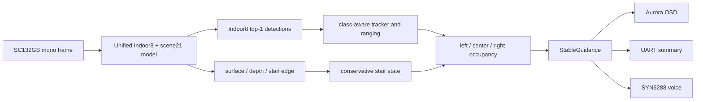

# GrayNav unified guidance stabilization (2026-08-14)

## Scope

This board update keeps the existing single `graynav_unified_indoor8_scene21.m1model` unchanged. It corrects CPU-side class tracking, multi-zone planning, distance presentation, stair visualization, and user-facing output. It does not retrain or reconvert the model.

## Perception and decision flow



Indoor8 never uses the legacy ROD25 person-part bridge. A high-confidence new class must occur twice before correcting an old class; ordinary changes require three observations and a 1.2 evidence ratio. This prevents a single furniture false positive from changing a person while allowing a mistaken PERSON track to recover to CHAIR or TABLE.

## Multi-zone guidance

Objects are assigned by horizontal box coverage rather than box center. A wide chair or table can therefore occupy multiple walking zones. Each zone exposes its nearest object, expected distance estimate, conservative planning distance, and risk.

The decision priority is system fault, confirmed stair, near multi-zone object, blocked surface, suspected stair, unknown road condition, then clear path. Turns are issued only when a side is stably safer; otherwise the system slows or stops instead of oscillating left and right.

## Aurora contract

- Layer 1: one action bitmap (`STOP`, `SLOW`, `LEFT`, `RIGHT`, or `CLEAR`).
- Layer 2: one object-name-free distance/position bitmap, such as `MID FRONT` or `NEAR MULTI`; it is cleared for `CLEAR`.
- Layer 3: stair geometry only, capped at three primitives. Suspected stairs show one measured edge band; confirmed stairs add a double outline derived from the step component and edge span.
- Layer 4: no more than two anonymous stable object boxes.

No wall X, corridor dots, object name, or synthetic stair arrow is drawn.

## UART contract

Normal mode emits a state change immediately subject to a 500 ms minimum interval, and otherwise one heartbeat every 2 seconds:

```text
[F006390] SLOW dir=right cls=chair dist=1.64m risk=WARNING zones=L:clear,C:chair@1.64,R:clear
```

`dist` is a filtered monocular fusion estimate. It is not a calibrated physical measurement and must not be described as centimetre-accurate. Navigation uses the separate conservative `safe_distance_m`. `dist=--` is allowed for clear, AI failure, or missing evidence.

## Board verification protocol

1. Show person, chair, table, bag, and overlapping person/furniture sequences; verify class recovery and at most two stable boxes.
2. Place hazards in each single zone, two zones, and all three zones; verify turn, slow, and stop behavior.
3. Hold a bed edge or chair back in view for two minutes; it must not reach confirmed stair.
4. Repeat upward and downward stair approaches ten times each; suspected geometry must precede confirmation.
5. Confirm normal UART output is readable at two-second heartbeats and diagnostic details remain disabled unless `A1_OUTPUT_SERIAL_DIAG=1`.
6. Run for 30 minutes and confirm no OSD add/flush failure, crash, or sustained memory growth.

## Flash candidate

The complete Docker build finished successfully with the following immutable
candidate evidence:

```text
zImage bytes  = 8,129,616
zImage SHA256 = FAF46AF9ECCD371D2DB10CD10D7A83BB28DFC409E6DF1CA926D1AE2F381F3102
model count   = 1
model SHA256  = 33EEC832710706B1153F468F219C08389A52BA3D21CBDFFCDE32CA5E25D66DA8
OSD assets    = 5 action + 20 object-free navigation bitmaps
```

The image is archived at
`E:\jichuang\firmware_archive\GrayNav_Unified_Guidance_20260814_FAF46AF9`.
It remains a board-test candidate until the verification protocol above passes.
The protected A797 rollback image remains read-only and hash-identical.
