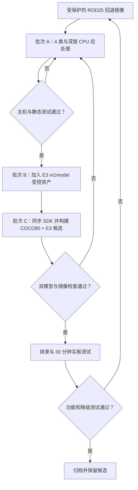

# GrayNav 本地后处理、系统构建与上板测试计划

日期：2026-08-11

## 1. 当前起点

已经完成：

- SurfaceDepth E3 的训练、固定可视化、最终 checkpoint 锁定；
- 静态 ONNX 导出、A1 算子审计和 PyTorch/ONNX 一致性；
- 160 个分层校准样本和 40 个量化评估样本；
- 官方 A1 INT8 转换，两个输出余弦相似度均高于 0.98；
- 转换证据、输入输出 scale、模型哈希和部署限制归档；
- 代码管理切换为直接提交并推送 `main`，不再使用本项目 Draft PR 流程；
- E3 四类/深度后处理、主机测试、SDK 同步和双模型候选构建已经完成。

尚未完成：

- 候选镜像归档；
- 烧录和实板双模型加载、稳定性与功能验收。

## 2. 分步策略

根据 2026-08-11 的实施决策，首次上板候选直接采用“COCO80 gray-copy 检测 + SurfaceDepth E3”。相机源仍是单通道 Y8；检测支路显式生成 `[G,G,G]`，道路/深度支路保持真单通道。这样优先验证完整的“常见物体 + 道路场景”演示能力，同时保留旧 ROD25 镜像作为回退。



## 3. 批次 A：完善纯 CPU 后处理

目标：在不引入模型二进制、不构建镜像的情况下，先让代码严格满足 E3 契约。

### A1. 四类分割契约

修改范围：

- `include/common.hpp`
- `include/surface_segmentation.hpp`
- `src/surface_segmentation.cpp`
- `src/surface_fusion.cpp`
- `tests/test_surface_logic.cpp`

要求：

1. 增加 `UNKNOWN_OTHER=3`，`SURFACE_CLASS_COUNT=4`。
2. `SurfaceCorridor` 增加 `unknown_ratio`。
3. 所有固定 `{0,0,0}` 初始化改成按类数安全初始化，避免再次扩类时越界。
4. 输出绑定严格检查 `4 x 64 x 64` 和 `16 x 64 x 64`，启动日志打印实际 dtype、元素数、输出序号和布局。
5. `unknown_other` 不参与危险连通域，但必须阻止 `safe_candidate=true`。
6. 中央走廊无法形成稳定 ground、blocked 或 step 证据时，输出 `primary_hazard=unknown_other`，最终动作至少为 `slow`。

### A2. 量化输出与深度分组

官方模型输出 scale：

```text
seg_logits   0.0690593868494
depth_logits 0.367095053196
```

运行时先记录 `ssne_getoutput()` 返回的 dtype：

- 若为 `SSNE_FLOAT32`，直接使用运行时已经提供的浮点输出；
- 若为 `SSNE_INT8`，按当前正式模型的对称 scale 反量化；
- 若 dtype、元素数或输出绑定不符合契约，单次推理失败并进入已有降级计数，禁止猜测输出。

深度后处理不再只按期望米数阈值硬切分。每个网格先对 16 个 logits 做稳定 Softmax，再按 bin center 汇总为 NEAR/MID/FAR 三组概率：

```text
NEAR: center < 1.25
MID:  1.25 <= center < 2.20
FAR:  center >= 2.20
```

中央走廊使用有效网格的分组概率与空间中位数。最高组概率与第二组概率之差 `< 0.20` 时输出 `UNKNOWN`；持续台阶危险始终覆盖 `FAR`。学习深度米值只留在内部诊断，不直接驱动语音或 Aurora。

### A3. 必需测试

至少覆盖：

- HWC 和 CHW 两种 4 类 logits 解析一致；
- 输入仍是 3 类或输出元素数错误时拒绝处理；
- `unknown_other` 占中央走廊时 `safe_candidate=false`，融合结果为 `slow`；
- 台阶危险连续 3 次中 2 次触发，消失连续 4 次后解除；
- blocked 达到阈值时不能 clear；
- 深度分组 margin `<0.20` 输出 unknown，`>=0.20` 才输出对应等级；
- `step_or_drop + far` 仍产生台阶避障动作；
- SurfaceDepth degraded 时保持检测动作不变。

门槛：测试全部通过、`git diff --check` 通过后，形成单独 commit。此批次不修改 SDK 编译副本。

## 4. 批次 B：正式模型资产与契约清单

目标：后处理稳定后再引入模型，避免二进制与不兼容代码同时进入提交。

1. 把正式模型以固定名称加入：

```text
board/obstacle_detect/app_assets/models/
  graynav_surface_depth_e3_gray1.m1model
```

2. 只为该精确路径增加 `.gitignore` 例外，不开放全局 `*.m1model`。
3. 同目录增加文本/JSON 清单，记录来源、bytes、SHA256、输入输出形状、输出顺序、scale 和官方余弦相似度。
4. CMake 默认 SurfaceDepth 文件名改为 E3 固定名称。
5. 提交前重新计算哈希并与证据文档比较：

```text
bytes  = 1,459,634
SHA256 = d40b6f6c6392d062a5c39625b3f39c69e579255583498e2c218bb8c2593106f1
```

本批次单独 commit，便于模型回滚和 Git 历史审计。

## 5. 批次 C：SDK 同步和首个候选构建

目标：使用现有 A1 COCO80 gray-copy 检测器与正式 E3 组合，验证完整双模型链路。

### C1. 同步前保护

1. 再次核对 Git 与 SDK 工作区状态。
2. 核对受保护镜像大小和 SHA256，确认两个备份仍存在。
3. 只同步批次 A/B 改动涉及的明确文件，不做整个目录覆盖。
4. 同步后逐文件比较 Git 副本与 SDK 编译副本。

### C2. 构建配置

第一候选显式使用：

```text
detector classes    = 80
detector channels   = 3（Y8 显式复制为 [G,G,G]）
detector model      = yolov8n80_graycopy_head6.m1model
surface enabled     = ON
surface model       = graynav_surface_depth_e3_gray1.m1model
voice               = ON
```

构建后必须核对：

- CMakeCache 与上述契约一致；
- rootfs 只安装这两个模型；
- 两个模型 SHA256 正确；
- `zImage < 15 MiB`；
- 编译日志没有缺模型、输出契约或链接警告。

只有全部通过才创建候选归档。新镜像不得复制到回退镜像路径。

## 6. 烧录与实板测试

### 6.1 先做双模型烟雾测试

启动后记录：

- detector 与 SurfaceDepth 的两个 `model_id`，必须不同；
- 两个输入数量、dtype 和输入 tensor；
- SurfaceDepth 两个输出的序号、dtype、元素数和布局；
- 每次 D/SD 推理耗时、失败计数、可用内存；
- `D -> D -> D -> SD` 是否按计划运行。

如果 SurfaceDepth 输出绑定失败或连续失败，系统必须进入 detector-only 降级，而不是退出。

### 6.2 30 分钟稳定性

要求：

- 无崩溃、无 watchdog 重启；
- 无持续内存增长；
- SurfaceDepth 刷新率不低于 2 Hz；
- 检测 tracker 在 SD 帧只预测，不删除目标；
- SYN6288 不阻塞 NPU 主循环；
- 降级播报只出现一次，不刷屏。

### 6.3 功能场景

每类至少重复 10 次，测试人员不得闭眼依赖系统行走：

| 场景 | 期望 |
|---|---|
| 平坦通路 | 稳定 PATH，不持续误报台阶 |
| 正面墙壁 | 中央 blocked，显示双线/X，给出 slow/turn/stop |
| 上行台阶 | 持续 STEP/DROP，不能被 FAR 覆盖 |
| 下行边缘 | 统一 STEP/DROP，不承诺区分上下行 |
| 暗光、反光、遮挡 | UNKNOWN，至少 slow |
| 人体与台阶同时出现 | 更紧急风险优先，检测框仍稳定 |
| SurfaceDepth 故障 | AI DEGRADED；检测、串口和语音继续 |

通过后使用 `archive_candidate.ps1` 归档 Git commit、两个模型、审计/校准契约、zImage 和 30 分钟日志。

## 7. 后续可选：真单通道 COCO80

当前候选先使用已有、已转换的 COCO80 gray-copy 模型。只有完成新的官方 A1 转换后，才可将其替换为真单通道 COCO80：

1. 构建/选择正式 COCO80 checkpoint；
2. 导出 head6、完成 A1 转换和 CPU 解码一致性；
3. 修正 COCO80 尺寸先验和语义筛选；
4. 替换检测器，不改 SurfaceDepth 后处理阈值；
5. 构建候选 2，重复双模型、30 分钟和功能测试；
6. 比较候选 1 与候选 2 的检测刷新率、人体遮挡召回和整体稳定性，再决定是否替换板上版本。

## 8. Git 提交序列

建议严格使用以下提交边界：

```text
docs: document SurfaceDepth E3 deployment status       已完成
fix(board): align SurfaceDepth E3 postprocessing       批次 A
test(board): cover four-class and depth ambiguity      批次 A
feat(board): add audited SurfaceDepth E3 model asset   批次 B
build(board): stage COCO80 plus SurfaceDepth candidate 批次 C
docs(board): record candidate image and board results  板测后
feat(detector): integrate true-mono COCO80 candidate   后续可选
```

如果一个实现和测试高度耦合，可以把批次 A 的 `fix` 与 `test` 合并为一个 commit；不得把模型二进制、Docker 构建产物和板测记录混在同一个提交中。
