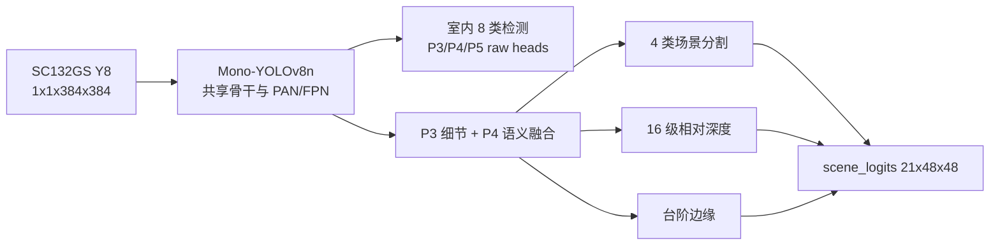

# GrayNav 室内单模型本地训练与转换前证据

日期：2026-08-13  
状态：训练、全量离线评估、可视化检查、ONNX 导出和 A1 转换输入准备完成；等待官方 A1 转换。

## 1. 最终模型契约



一个 ONNX / `.m1model`、一次 NPU 推理、七个静态输出：

| 张量 | 形状 |
|---|---|
| `images` | `1x1x384x384` |
| `cls_p3` / `reg_p3` | `1x8x48x48` / `1x64x48x48` |
| `cls_p4` / `reg_p4` | `1x8x24x24` / `1x64x24x24` |
| `cls_p5` / `reg_p5` | `1x8x12x12` / `1x64x12x12` |
| `scene_logits` | `1x21x48x48` |

`scene_logits` 的 `0..3` 为 ground、blocked、step、unknown；`4..19` 为
16 级相对深度；`20` 为台阶边缘。

检测类别顺序固定为：

```text
person, chair, dining_table, backpack,
handbag, suitcase, couch, bench
```

## 2. 初始化与紧凑数据路线

- 检测骨干和 P3/P4 head 来自官方 COCO YOLOv8n，首层按
  `Wgray = WR + WG + WB` 折叠为真单通道。
- A1 不安全的 P5 首层使用 `1x1 256->128` 适配后复用预训练 P4 branch。
- 场景、深度兼容层从 SurfaceDepth E3 epoch49 导入。
- 共享检测骨干冻结；先进行 5 epoch 场景恢复，再以低学习率联合训练检测头和场景分支。
- 没有下载 COCO2017 全量。检测数据使用 VOC2007 trainval 加已有 COCO128 小型回放；
  场景数据使用已有 ADE20K、StairNetV3、NYUv2。
- VOC2007 原始包：`460032000 bytes`，SHA256
  `7D8CD951101B0957DDFD7A530BDC8A94F06121CFC1E511BB5937E973020C7508`。
- 训练集 1378 张检测图；验证集 1296 张检测图。场景 prepared-v2 为
  23245/3205 张 train/val。

COCO128 只为稀有 COCO 类提供少量回放，无法证明 backpack、handbag、suitcase、bench
具有与 person 相同的鲁棒性。普通纸箱不作为命名检测类别，部署时由
`blocked_surface + relative depth` 作为通用障碍处理。

## 3. 本地训练

- GPU：RTX 4060 Laptop 8 GB。
- `seed=42`、输入 384、AdamW、AMP、5 epoch warm-up、35 epoch。
- 物理 batch 从 16/累积 2 在 epoch15 边界切换为 32/累积 1；有效 batch 始终为 32。
- 共享 YOLO 主干冻结，因此显存峰值小于 1 GiB；这不是训练失败。
- TensorBoard 与 tqdm 均已记录，训练正常输出
  `GRAYNAV_UNIFIED_INDOOR_TRAINING_OK`。

## 4. 全量候选评估与选模

六个 checkpoint 使用同一固定顺序重新评估：

- 1296 张完整检测验证图；
- 1296 张自动局部人体验证图；
- 3205 张场景验证图。

最终选择 `best_safety.pt`（训练 epoch 29，checkpoint 中 `epoch=28`）：

| 指标 | 结果 |
|---|---:|
| person AP50 | 0.7712 |
| person recall | 0.9199 |
| 自动局部人体 recall | 0.9598 |
| chair AP50 | 0.5831 |
| dining table AP50 | 0.6112 |
| couch AP50 | 0.6701 |
| ground IoU | 0.5731 |
| blocked IoU | 0.5735 |
| step F1 | 0.7055 |
| stair-edge F1 | 0.0805 |
| 无台阶图像 step 误报率 | 0.1244 |
| depth AbsRel | 0.3668 |
| depth delta1 | 0.4835 |
| 近远排序准确率 | 0.8348 |

检测 `mAP50=0.3765` 是八类宏平均；验证集中 backpack/handbag/suitcase/bench
真值极少或为零，四类 AP 为零会显著拉低宏平均。因此部署能力应分别看已充分验证的
person/chair/table/couch，不能把宏平均解释为完整 COCO 能力。

## 5. 固定可视化检查

固定 `seed=42`，ADE20K、StairNetV3、NYUv2、检测各 8 张；mono、预测、GT、深度和
台阶边缘分别保存，不使用挑选后的拼图。

观察结论：

- 远处和局部人体能够形成合理检测框；
- ADE 室内样本能区分大面积阻挡面与底部地面候选；
- NYUv2 相对深度不是常数图，能够表达人物、床、家具的空间层次，但边界比 GT 粗；
- StairNet 中能产生台阶相关纹理和水平边缘，但暗光及重复纹理样本仍可能大面积误判 STEP；
- stair-edge F1 较低，不能单独触发报警。

因此板端禁止显示整幅分割掩膜或使用单帧全图 ArgMax 报警。台阶必须联合：

```text
下方中央走廊
+ step ratio / connected region
+ 最多两条水平边缘峰值
+ 跨边缘深度等级变化
+ 最近三次中至少两次成立
```

学习深度只输出 `NEAR/MID/FAR/UNKNOWN` 和接近趋势，不显示或播报米数。

## 6. 最终转换前产物

外部受控目录：

```text
E:\jichuang\graynav_local_training\artifacts\unified_indoor8_final_best_safety
```

| 文件 | bytes | SHA256 |
|---|---:|---|
| `graynav_unified_best_safety_epoch29.pt` | 19117704 | `F28E5732CE4ED2432523D2AD508A21699C2494672F44295F2DE8A1D572645F23` |
| `graynav_unified_indoor8_scene21_gray1.onnx` | 12328061 | `2902D0AEDE72DD21ECD3D543142FF7C125AD5E00B19B5974D090CFCE9837AE54` |
| `a1_datasets/datasets.zip` | 22181879 | `E3A3DA72EEF2436D75CD189D84EA413BE02824A4640EAB4799EF9A4990CAEA98` |
| `official_a1_submission.zip` | 32807345 | `A1181FC42EE22298475498B7069666A46505E1F101FE817101662B962C676977` |
| `graynav_unified_visualization_best_safety_seed42.zip` | 14474108 | `9CE44C90BE14FCE82E80CD1CB2A8F37E9B1E90C0DFDDC3ABC2E33E21A96E59CF` |

提交 ZIP 只含：

```text
graynav_unified_indoor8_scene21_gray1.onnx
datasets.zip
config.toml
```

校准集为 160 张，量化评估集为 40 张；来源覆盖 VOC2007、COCO128、ADE20K、
StairNetV3、NYUv2，二者零重叠。

## 7. ONNX 与 A1 静态审计

- opset 12、静态 batch 1；
- 输出 shape 全部符合七输出契约；
- 算子为 Conv/Add/Concat/Constant/MaxPool/Mul/ReLU/Resize/Sigmoid/Split；
- 不含动态 Reshape、Gather、Slice、Transpose、NMS、Softmax、ArgMax；
- A1 静态预检查通过，最终权威仍为官方 A1 编译器。

200 张真实灰度输入的 PyTorch/ONNX 一致性：

- 七输出最低 cosine 均大于 `0.999999999997`；
- segmentation grid agreement = 1.0；
- depth level agreement = 1.0；
- stair edge sign agreement = 1.0。

## 8. 官方转换后的审计

收到官方转换 ZIP 后执行：

```powershell
E:\jichuang\graynav_local_training\env\Scripts\python.exe `
  E:\jichuang\graynav-obstacle-detect\model_optimization\scripts\audit_unified_a1_conversion.py `
  --package <官方转换ZIP> `
  --report <输出conversion_audit.json> `
  --threshold 0.90
```

审计器要求：

- 恰好一个 `.m1model`；
- 官方报告、输入 scale、输出 order/scale 文件齐全；
- 七个输出名称完整，order 为 0..6 的唯一排列；
- 所有量化 scale 为正；
- 官方汇总、逐样本以及从 `ori/sim.npy` 独立重算的 cosine 均不低于 0.90；
- 独立重算值与官方报告一致。

转换审计通过前，不更新 C++ 模型契约，不构建或烧录新镜像。
# Official A1 INT8 conversion

The selected epoch-29 unified checkpoint was converted once with the official
A1 compiler. The deployable model is tracked as
`board/obstacle_detect/app_assets/models/graynav_unified_indoor8_scene21.m1model`.

| Artifact | Value |
|---|---|
| Official conversion ZIP SHA256 | `B2B7444EEB66F29A38318165277C656194332BE63E694E162D1F811C7B58AE41` |
| Deployable m1model bytes | `4,150,950` |
| Deployable m1model SHA256 | `33EEC832710706B1153F468F219C08389A52BA3D21CBDFFCDE32CA5E25D66DA8` |
| Input | `images`, order 0, scale 0.003921568859368563 |
| Output count | 7 |
| Official evaluation samples | 10 |

Official aggregate cosine similarities:

| Output | Shape | Order | Quantization scale | Cosine similarity |
|---|---:|---:|---:|---:|
| `cls_p3` | `1x8x48x48` | 0 | 0.3329733610 | 0.9945854664 |
| `reg_p3` | `1x64x48x48` | 1 | 0.1015515029 | 0.9637060285 |
| `cls_p4` | `1x8x24x24` | 2 | 0.2165361345 | 0.9911302686 |
| `reg_p4` | `1x64x24x24` | 3 | 0.0778520629 | 0.9412578464 |
| `cls_p5` | `1x8x12x12` | 4 | 0.3593141437 | 0.9906339884 |
| `reg_p5` | `1x64x12x12` | 5 | 0.0933920816 | 0.9683737516 |
| `scene_logits` | `1x21x48x48` | 6 | 0.6104978919 | 0.9697354972 |

All aggregate and per-sample outputs pass the required 0.90 gate. The global
per-sample minimum is `reg_p4=0.9160173535`; therefore the first board test must
check medium-scale box decode, NMS and tracker stability carefully. The minimum
`scene_logits` similarity is `0.9508895874`.
