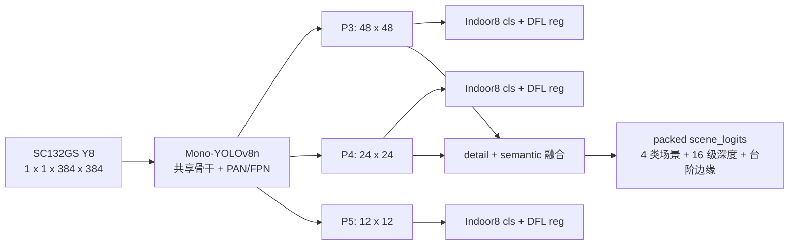

# GrayNav 单一多任务感知模型重构设计

日期：2026-08-11

## 1. 重构原因

COCO80 + SurfaceDepth E3 双模型镜像已经完成烧录和首次实板测试。人体检测可以运行，
但道路分支持续进入 `DETECTION_DEGRADED_SURFACE_DEPTH`，Aurora 没有地面、墙面或台阶
提示，并出现密集黑点、文字重叠和难以阅读的高频串口输出。

本轮重构同时解决三个问题：

1. NPU 只加载并运行一个模型，取消两个模型的常驻与 `D/D/D/SD` 切换；
2. 一个共享骨干同时提供物体检测、道路语义和相对深度证据；
3. 后处理从“展示所有内部状态”改为“稳定、限量、可解释的演示输出”。

现有 SurfaceDepth E3 只有分割头和深度头，没有检测头，不能仅靠 C++ 后处理变成
单模型综合感知。统一模型必须重新设计、联合训练、导出并完成一次正式 A1 转换。

## 2. 统一模型契约



固定输入：

```text
images  float32  1 x 1 x 384 x 384  range [0, 1]
```

固定 raw 输出：

```text
cls_p3       1 x  8 x 48 x 48
reg_p3       1 x 64 x 48 x 48
cls_p4       1 x  8 x 24 x 24
reg_p4       1 x 64 x 24 x 24
cls_p5       1 x  8 x 12 x 12
reg_p5       1 x 64 x 12 x 12
scene_logits 1 x 21 x 48 x 48
```

道路类别保持：

```text
0 ground_candidate
1 blocked_surface
2 step_or_drop
3 unknown_other
```

`scene_logits` 的 0..3 为场景分割、4..19 为 16 级相对深度、20 为台阶边缘。
室内检测顺序固定为 person、chair、dining_table、backpack、handbag、suitcase、couch、
bench。部署图不包含 DFL decode、NMS、Softmax、ArgMax、连通域、时序投票或决策，
这些操作统一放到 CPU。

## 3. 网络与 A1 约束

- 官方 YOLOv8n RGB 首层按 `W_gray = W_R + W_G + W_B` 折叠为真单通道；
- 三个检测尺度使用两层深度可分离卷积和最终 1x1 raw 输出，避免 P5 的
  `3x3x256=2304` 超过 A1 卷积输入限制；
- YOLOv8 C2f 使用等价的固定通道 `Split`，禁止导出器生成
  Shape/Gather/Slice/Div 动态分块；
- 道路分支使用 P3 的 48x48 细节特征和经 1x1 Conv 降维、nearest Resize 的 P4 语义特征；
- 融合只使用 Add、ReLU 和轻量深度可分离卷积；
- 静态 batch 1、NCHW、opset 12，不允许动态 shape；
- 主要算子限定为 Conv、BN、ReLU、Add、Concat、Mul、Pool、Resize、Constant；
- 禁止 Softmax、ArgMax、NMS、通用 Transpose、动态 Reshape、Gather、Slice、Sub 和 Div；
- 正式训练前只做本地随机权重 ONNX 静态审计，不提交 A1 正式转换；
- 用户确认最终训练可视化后，正式 `.m1model` 只转换最终模型一次。

目标是单个 INT8 模型不超过 5 MiB；最终约束以官方 A1 编译器和实板 SSNE 为准。

### 3.1 随机图预审结果

2026-08-11 本地完成两轮随机图审计。第一轮正确拦截了动态 C2f 分块和 P5 普通 3x3
检测头；完成上述 A1-safe 调整后第二轮通过：

```text
input          images 1 x 1 x 384 x 384
outputs        3 x Indoor8 cls + 3 x DFL64 reg
               packed scene 1 x 21 x 48 x 48
status         结构已更新，须在训练主机重新导出并审计
```

此前随机图结果只证明基础 YOLO/FPN 路径可导出，不作为当前 Indoor8 + scene21 图的
最终证据。当前实现仍保留首层折叠、静态 C2f split、A1-safe 检测头和 E3 兼容层，
但必须在云端环境重新生成审计报告。

## 4. 训练方案

训练不新增自采图片、不进行人工标注、不使用蒸馏。

| 数据源 | 监督任务 |
|---|---|
| COCO train/val | 筛选室内 8 类检测与自动局部人体增强 |
| ADE20K prepared-v2 | ground / blocked / step / unknown 分割 |
| StairNetV3 prepared-v2 | 台阶与非台阶负监督 |
| NYUv2 | 16 级深度、相对顺序和近中远监督 |

所有 RGB 输入在数据加载阶段按固定规则转为单通道。没有对应标注的任务使用 loss mask，
不得用伪标签冒充监督。

训练分两段：

1. 前 5 epoch 冻结共享骨干，只恢复 A1-safe Indoor8 检测头；
2. 随后 35 epoch 联合训练，按 45% COCO、20% ADE、20% StairNet、15% NYUv2 采样，
   分别记录 Indoor8 AP50、局部人体 recall、场景指标、台阶边缘和深度顺序。

联合损失初始定义：

```text
L = 1.0 * L_detect + 1.0 * L_seg + 0.4 * L_depth + 1.2 * L_stair_edge
```

若共享骨干梯度冲突导致 COCO 检测明显下降，优先调整任务采样和 loss 权重；首轮不增加
复杂梯度手术算子，也不改变部署图。

## 5. 输入调度

统一模型每个调度帧都运行一次，不存在模型切换：

- 上方 720x720 ROI：主要服务远处和完整目标检测，道路输出不进入决策；
- 下方 720x720 ROI：同时服务近场目标、道路分割和相对深度；
- ROI 固定按 LOWER、LOWER、UPPER 循环；每帧都是同一个输入、同一个 `model_id` 和同一组七个输出；
- tracker 每帧更新；道路结果只在下方 ROI 帧更新并带时间戳；
- 输出数量、名称、shape、dtype、量化 scale 或 layout 任一不符即拒绝推理结果。

该策略减少模型常驻和切换开销，但实际实时性必须以板端 P50/P95 推理时间验证，不能由
模型数量直接推断。

## 6. 后处理重构

### 6.1 检测

- CPU 完成 Sigmoid、DFL、box decode、NMS 和语义白名单；
- Aurora 每帧最多显示置信度最高且经过 tracker 稳定的 3 个框；
- person 支持遮挡和侧身，不能要求人脸；不再在画面上动态点阵绘制 `PERSON` 单词；
- 只有尺寸先验可靠且框完整时才计算几何距离，否则只输出相对深度等级；
- 部分人体框、狗、包和盆栽等不得用固定物高伪造米制距离。

### 6.2 道路与深度

- 48x48 分割 logits 先 ArgMax，再做一次轻量多数滤波；
- 只统计左、中、右下方走廊，忽略天空和画面上部；
- 台阶/落差必须满足连通面积和跨帧持续条件；单帧细线不直接触发 STOP；
- blocked_surface 以中央走廊占比和边界连续性判断墙面/大阻挡；
- unknown_other 永不当作可通行地面；
- 深度使用框下半部或中央走廊的等级分布、中位数和趋势，只输出 NEAR/MID/FAR/UNKNOWN；
- 持续 STEP/DROP 优先于不可靠的 FAR，深度证据冲突时降低置信度而不是盲目平均。

### 6.3 决策

固定优先级：系统故障、近场目标急停、持续台阶/落差、中央阻挡、路况未知、明确可通行。
只有检测和道路证据都有效且稳定无风险时才输出 CLEAR。统一模型故障时不得沿用过期深度
显示 NEAR；进入降级后只保留仍有有效时间戳的结果并显示 `AI_FAIL`。

## 7. Aurora、串口和语音

### Aurora 灰度 OSD

每帧最多包含：

- 3 个稳定目标框；
- 1 个动作静态贴图：CLEAR/SLOW/STOP/LEFT/RIGHT；
- 1 个道路静态贴图：WALL/STEP/UNKNOWN/AI_FAIL；
- 1 组中央道路轮廓或台阶边缘。

删除动态物体文字、风险点阵条、大面积掩膜和多处重复状态。每次状态切换先清除对应 OSD
图层，限制矩形数量并检查坐标，避免残留和越界黑点。

### 串口

默认每秒最多一行：

```text
[NAV] action=STOP object=PERSON:CENTER:NEAR road=STEP:CENTER depth=UNKNOWN ai=OK
```

加载、输出契约和性能数据只在启动或 `A1_OUTPUT_SERIAL_DIAG=1` 时使用 `[DIAG]` 输出。
禁止每 5 帧重复打印相同状态。

### 语音

语音仅在 action、hazard_type、direction 或故障状态发生稳定变化时触发。STOP 和系统故障
允许抢占；相同危险不重复长描述；恢复正常只播报一次。语音线程不得阻塞 NPU 主循环。

## 8. 实施门控

1. 保存本次失败截图、启动日志和失败镜像哈希，确认 SurfaceDepth 降级发生位置；
2. 实现统一 PyTorch 模型、Indoor8 数据管道和 scene21 本地静态审计；
3. 完成 5+35 epoch 训练、固定独立可视化和检测/道路/深度分项评估；
4. 锁定一个 checkpoint，导出 ONNX并做 PyTorch/ONNX 一致性；
5. 生成平衡校准集，执行唯一一次正式 A1 INT8 转换；
6. C++ 使用一个模型、七输出 shape 绑定和 packed scene 后处理；
7. 主机测试、同步 SDK、Docker 完整构建、归档、烧录和实板验证。

板端验收至少包括：单个 `model_id`、输出契约正确、人体/椅子/墙面/台阶功能场景、
检测刷新率不低于 5 Hz、道路刷新率不低于 3 Hz、推理 P95 小于 200 ms、30 分钟无
崩溃或持续内存增长、串口可读、语音不刷屏、最终 `zImage < 15 MiB`。阈值用于识别
明显失效，不用于宣称医疗级或独立出行安全能力。

## 9. 回退与边界

可靠回退镜像继续保持只读：

```text
bytes  = 8,214,488
SHA256 = A7976710ECB456CB312D18F0195DCAE496ED652EFC582AB698EBC3EB7B055530
```

新的统一模型镜像必须单独归档 Git commit、模型/ONNX/m1model/zImage 哈希、转换报告和
板端日志。任何失败候选不得覆盖回退文件。学习深度仍只作为相对风险证据，不播报米制
距离；公开数据训练不能证明对 SC132GS 户外域的泛化上限。
